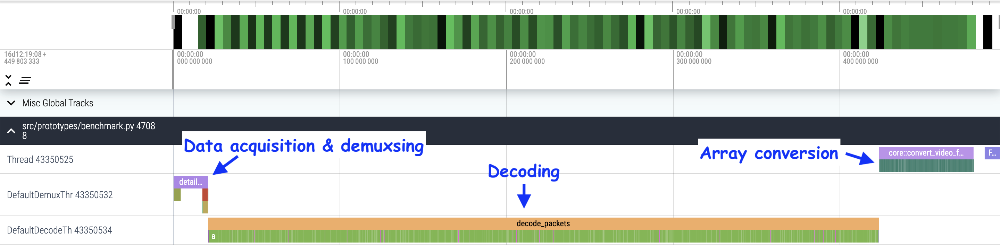

# Understanding I/O Bottleneck

Converting media data stored in commonly used formats, such as video in MP4 container, into coniguous array formats that Machine Learning frameworks can handle is often a bottleneck of training ML models. It is, however, not so straightforward to look into what part of the conversion process is actually causing the bottleneck. This is largely because the software used to decode media data are often written in low-level languages like C and C++, and probing the performance of each step in the whole decoding process is limited without modifying the software.

In this tutorial, we start from the overview of what consists the conversion process, and then look at the some conversion scenarios which exhibits the bottleneck but for different reasons.


## Overview of the conversion process

The process to convert media data into array formats is roughly consists of the following steps;

1. Transfer data from the source.
2. Demux the data into packets.
3. Decode the packets into frames.
4. Combine the frames and convert it into an array.

In addition, there are optional steps;

1. Pre-process the frames before and/or after converting to array.
2. Move the array to hardware device.

## Data acquisition, demuxing and decoding

Generally speaking, media data are composed of multiple streams. For example, a single video file has multiple media streams, usually one image sequence and accompanying audio sequence. The process to combining multiple signals into one signal is called muxing (multiplexing), and the process to recover individual streams from the combined signal is called demuxing (demultiplexing).

Demuxing slices the source data into series of data chunk called packet. It contains encoded media of a particular stream from the input data.

Decoding receives packets of specific stream and recover raw frames.

The following figure illustrates this.

[./demuxing.png](./demuxing.png)

One important aspect of demuxing and decoding is that these steps can be decoupled. Demuxer and decoder are stateful objects, but they do not rely on each other to function. Demuxer object is instantiated par file, but decoder objects are created for each stream.

## The composition of processes

We use FFmpeg, the defacto industry standard software for media processing, to perform demuxing and decoding. FFmpeg provides a set of API to implement demuxing and decoding in flexible manner, which gives us choices how these processes are organized.

For example, we can separate or interweave data acquisition and demuxing

- Fetch the entire media data from remote source before kicking off the demuxing.
- Fetch data from remote source chunk by chunk as demuxer requests new data.

Similarly, we can separate or interweave demuxing and decoding

- Demux the entire stream before kicking off the decoding.
- Decode packets as soon as demuxer produce them.

Each choice has pros and cons, and the choice has to be made according to the target application.

For example, if the application requires real-time processing of incoming data, it is advantageous to perform decoding as soon as the data is available, so interweaving data acquisition, demuxing and decoding is a reasonable choice.

A pseudo code for such composition would look like the following.

```python
def demux_and_decode(src):
    demuxer = Demuxer(src)
    decoder = Decoder(...)
    frames = []
    while True:
        packet = demuxer.receive()
        if packet is None:
            break

        decoder.send(packet)
        while True:
            frame = decoder.receive()
            if frame is None:
                break
            frames.append(frame)
```

On the other hand, if the application demands high throughput, separating data acquisition and decoding gives us opportunity to better calibrate the system for handling different kinds of bottleneck.

A pseudo code for such composition would look like the following.

```python
def demux(src):
    demuxer = Demuxer(src)
    packets = []
    while True:
        packet = demuxer.receive()
        if packet is None:
            break
        packets.append(packet)
    return packets    


def decode(packets):
    decoder = Decoder(...)
    frames = []
    for packet in packets:
        decoder.send(packet)
        while True:
            frame = decoder.receive()
            if frame is None:
                break
            frames.append(frame)
    return frames
```

## Decoding performance analysis - baseline (compute bound)

Now we have basic understanding of how media conversion works, let's look into how they perform in various scenario, and see what causes bottlenecks.

First, we look at the baseline case where data is stored in local file system so that there is virtually no overhead or latency slowing down the whole process.

The video data we use can be found [here](https://download.pytorch.org/torchaudio/tutorial-assets/stream-api/NASAs_Most_Scientifically_Complex_Space_Observatory_Requires_Precision-MP4_small.mp4). The frame rate is 29.97, the resolution is 960x540, the format is H264, and the pixel format is YUV420P.

The benchmark was performed using Apple M1 Macbook Pro with FFmpeg 6.0.

In the first example, we decode 15 frames from 60 to 60.5 seconds and convert them into one array. We do not perform color space conversion or resizing. The original video has the resolution of 960x540, and the pixel format is YUV420P. The size of each decoded frame is `[1, 810, 960]`, so the shape of the resulting array is `[15, 1, 810, 960]`.

We use SPDL's Perfetto integration to generate tracing.


The composition is;

|                               | Time [ms] |
|-------------------------------|-----------|
| Data Acsuisition and demuxing |        22 |
|                      Decoding |       109 |
|              Array conversion |         1 |

#### Time to decode a frame

The following table shows the histogram of the duration it takes to decode a frame (the time `avcodec_send_packet` to complete).

The average time is 0.95 millisecond.

| Time bucket [ms] | Count |
|:----------------:|:-----:|
|    0.00 - 0.25   |     4 |
|    0.25 - 0.50   |    29 |
|    0.50 - 0.75   |    29 |
|    0.75 - 1.00   |    20 |
|    1.00 - 1.25   |     2 |
|    1.25 - 1.50   |     1 |
|    1.50 - 1.75   |    10 |
|    1.75 - 2.00   |    15 |
|    2.00 - 2.25   |     2 |
|    2.25 - 2.50   |     2 |
|                  |       |
|    5.50 - 5.75   |    1† |

† The first frame. It is assumed that this call performs additional initialization on decoder side.


???+ note

    The actual number of frames decoded (114) does not match the number of frames returned (15). This is because, internally, the decoding has to start from the nearest keyframe of the specified window.

## Common bottlenecks

### I/O Bound

In a large scale ML training, training data are often stored in remote data store or databases.

Now let's change the data source to somewhere remote. In this example we use the [URL](https://download.pytorch.org/torchaudio/tutorial-assets/stream-api/NASAs_Most_Scientifically_Complex_Space_Observatory_Requires_Precision-MP4_small.mp4) as the data source. FFmpeg's demuxer supports HTTPS protocol natively, so it will fetch data from the remote location as it needs.

???+ note

    Fetching remote data this way gives an opportunity to stop the network data transfer once the frames of interest are decoded.
    
    However, data are not always transfered from the beginning to the end. For example, MP4 videos often have MOOV atom (metadata required to decode frames) at the end. So MP4 demuxer attempts to seek to the end of the file. If the underlying protocol does not support seek actions (for example via Range HTTP request header), it will go through all the data once, discard them, then seek back and request duplicated data.
    
    Therefore, when dealing with network I/O, there is tradeoff between downloading the entire file first and access it as local file, or directly process the data transfered over network as in-memory buffer.


The composition is;

|                               | Time [ms] |
|-------------------------------|-----------|
| Data Acsuisition and demuxing |      1188 |
|                      Decoding |       151 |
|              Array conversion |         1 |

### Memory Bound

Another example of bottleneck comes from allocating large chunk of memory. In the following example, we decode 10 seconds(299 frames) from at 60 seconds point of the same video from local file system.



The composition is;

|                               | Time [ms] |
|-------------------------------|-----------|
| Data Acsuisition and demuxing |        20 |
|                      Decoding |       402 |
|              Array conversion |        56 |

The deocding time grows from 109 ms to 400 ms with similar QPS (~1000), but the time it takes to convert the decoded frames to array is not proportional to the number of frames; from 1 ms (for 15 frames) to 56 ms (for 299 frames). Now the array conversion takes longer than demuxing.

This example is not very representative of the real scenario, but the cost of allocating a large chunk of memory is something practitioners should be aware of.

### Other issues

#### Redundant memory copying

#### Frequent costly hardware operations
