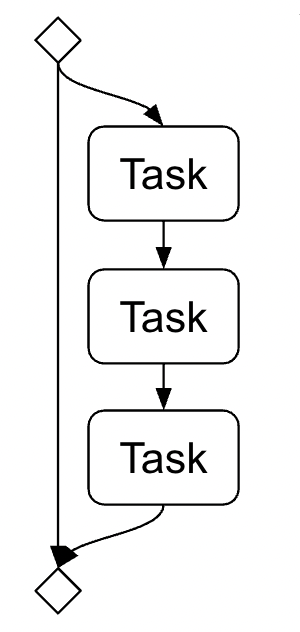
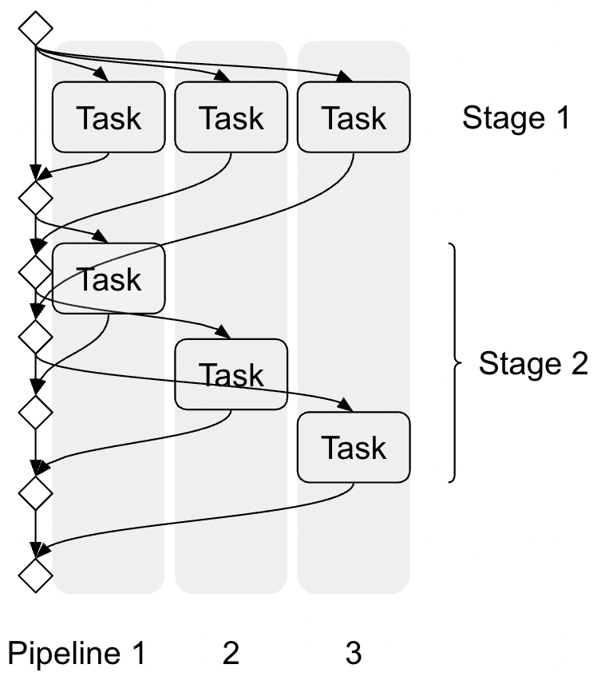

Implementing Orchestration Mechanism
====================================

The async I/O makes it easy to build complex asynchronous execution flow.
To illustrate this, in this section, we attempt to implement a pipeline
system with a bare thread pool executor.
It reveals that waiting on future is not composable, and the code becomes
complex quickly,
which motivates the use of an alternative abstraction, the event loop.

Concurrent execution and Future
-------------------------------

.. py:currentmodule:: concurrent.futures

Let's say we have multiple tasks that we want to complete as soon as possible.
For the sake of simplicity, let's assume that the tasks are independent each
other so we don't need to think about synchronization and such.

There are multiple ways to conccurently execute functions.
Python's :py:mod:`concurrent.futures` module offers
:py:class:`ThreadPoolExecutor` and :py:class:`ProcessPoolExecutor`.
(Python 3.14 will introduce |ipe|_.)
Each executor has different constraints, but here,
we use multi-threading just for an illustration purpose.†

.. |ipe| replace:: ``InterpreterPoolExecutor``
.. _ipe: https://docs.python.org/3.14/library/concurrent.futures.html#concurrent.futures.InterpreterPoolExecutor

.. admonition:: † Note on multi-threading
   :class: Note

   You might be aware that Python's GIL prevents effective use of
   multi-threading.
   The same rule applies in the Async I/O as well, as noted in the docstring of
   :py:func:`asyncio.to_thread`.
   However if we only use functions that release the GIL,
   it is possible to run operations concurrently,
   even when using multi-threading.

The following steps are typical way to run a task with an executor.

1. Submit a task to the executor.
2. Wait for the task to complete.
3. Check whether the job succeeded or not.

The following code snippet illustrates this

.. code-block::

   # 0. Create a thread pool executor. ††
   executor = ThreadPoolExecutor(max_workers=...)

   # 1. Submit a task
   future = executor.submit(fn, ...)

   # 2. Wait for the task to complete.
   # The code can do other things meanwhile.
   ...

   # 3. Attend to the completion and check the result.
   try:
       result = future.result()
   except Exception:
       # Task failed
       ...
   else:
       # Task succeeded
       ...

.. admonition:: †† Note on executor
   :class: Note

   When using executor, it is advised to use a context manager to
   properly shutdown it.
   Here, it is omitted for brevity.

The following figure depicts the execution flow.
It delegates the task execution to a sub-thread,
then the main thread actively waits for its completion.

.. image:: ../_static/data/concurrent_1.png
   :width: 180

Performing multiple tasks concurrently
--------------------------------------

Now let's process more than one task concurrently.

Since data loading is composed of operations with different performance
bounding factors
(such as network bandwidth, compute resource, and memory bandwidth),
we want to split the procedure into small unit of tasks with
different bounding factors and pipeline them.

Chaining task
-------------

First, we attempt to build a task chain.
We can extend the previous example by attaching the next step when the task
completed successfully.
The following code shows one way to chain three tasks.

.. code-block::

   future1 = executor.submit(fn1, ...)
   try:
       result1 = future1.result()
   except Exception:
       ...
   else:
       future2 = executor.submit(fn2, result1, ...)
       try:
           result2 = future2.result()
       except Exception:
           ...
       else:
           future3 = executor.submit(fn3, result2, ...)
           try:
               result3 = future3.result()
           except Exception:
               ...
           else:
               ...

The cyclomatic complexity of the code increased a lot.
It resembles the notorious callback hell, which was quite common in
JavaScript before the introduction of promise chaining and async/await.
(In fact, this tutorial is reliving the evolution of asynchronous
programming paradigm,
though we skip the intermediate and go straight to the Async I/O)

We can simplify this by putting all task functions in a sequence.

.. code-block::

   def chain(task_fns: Sequence[Callable], input, executor):
       result = input
       for fn in task_fns:
           future = executor.submit(fn, result)
           result = future.result()  # blocking
       except Exception:
           ...
       return result

This looks simpler but there is a fundamental problem.
We need to attend to a task completion with :py:meth:`Future.result` method
for each task.
However, since this method will block until the task is completed,
we are not able to do other works while waiting.
As a result, this ``chain`` function is blocking, and we cannot
call it multiple times concurrently.
In the end, without composability, this function is not so different
from the regular synchronous function.

.. image:: ../_static/data/concurrent_2.png
   :width: 180

The ``Future`` class has :py:meth:`~Future.add_done_callback` method.
So we could chain the tasks using the callback.
The following code is one attempt.

.. code-block::

   def callback_chain(fns: Sequence[Callable], input, executor):

       futures = [None for _ in range(len(fns))]

       def cb(future, i):
           try:
               result = future.result()
           except Exception:
               # Mark the futures as failed
               futures[-1] = future
           else:
               if i < len(fns):
                   futures[i] = executor.submit(fns[i], result)
                   futures[i].add_done_callback(partial(cb, i = i + 1))

       futures[0] = executor.submit(fns[0], ...)
       futures[0].add_done_callback(partial(cb, i = 1))

       return futures

One can compose the ``callback_chain`` by calling multiple times, then
wait at the last future element of the returned values.

.. code-block::

   futures1 = callback_chain(fns, input1)
   futures2 = callback_chain(fns, input2)

   while futures1[-1] is not True:
       sleep(...)

   result1 = futures1[-1].result()

   while futures2[-1] is not True:
       sleep(...)

   result2 = futures2[-1].result()

This achieves task chain with composability to some degree, but the way
to attend to a task competion is cumbersome.

Running multiple pipelines
--------------------------

If we want to process multiple tasks concurrently, we can submit multiple tasks as follow.

.. code-block::

   futures = [executor.submit(func, item) for item in items]

This code may look simple, but it introduces many complications.

The first concern is the execution time.
We cannot assume that the tasks complete in the order they are scheduled.
So instead of iterating the ``Future`` objects, we rather want to react to a
completed task, when it is completed.

Fortunately, there is a out-of-box solution for this.
The :py:func:`concurrent.futures.wait` function can attend to multiple of
:py:class:`concurrent.futures.Future` objects and return when one of them is completed.

.. code-block::

   futures = {executor.submit(task...) for task in tasks}

   while futures:
       done, futures = cnocurrent.futures.wait(futures, return_when=FIRST_COMPLETED)

       for future in done:
           try:
               result = future.result()
           except Exception:
               # A task failed
               ...
           else:
               # A task succeeded
               ...

The ``concurrent.futures.wait`` function is a blocking function, but
we can wait for multiple ``Future`` objects, and react to a completed one quickly.
The following figure depicts the execution flow.

.. image:: ../_static/data/concurrent_4.png

Now, let's try to chain tasks on top of this.
Say the tasks we invoked in the previous example represent the first step
of data loading pipeline, we can invoke the next step when they succeed.

Let's introduce a magical helper function ``get_next_task`` which returns
a function for the next stage, and ``None`` if there is no next stage.

We can extend the pipeline like the following.

.. code-block::

   futures = {executor.submit(task...) for task in tasks}

   while futures:
       done, futures = wait(tasks, return_when=FIRST_COMPLETED)

       for future in done:
           try:
               result = future.result()
           except Exception:
               # A task failed
               ...
           else:
               # A task succeed
               # Check and fetch the next stage
               if (task_fn := get_next_task(result)) is not None:
                   # Invoke
                   future = executor.submit(task_fn, result)
                   futures.add(future)

This approach accomplishes the basic pipelining, but its functionality is limited.
The pipeline we build with SPDL needs at least the following features.

- It runs the pipeline only for the items submitted at the beginning.
  We want to start running pipelines for more items as the current ones complete.
- It uses the same concurrency for all the stages.
  We want to assign different concurrency for different stages.
  For example, GPUs do not support transferring multiple data concurrently so
  we want to have at most one transfer task anytime.

How can we accomplish this?

One approach is to introduce a buffer between stages and adjust the concurrency of
stages manually, by limiting the number of submissions.
This approach requires proper handling of back pressure.
We would need to block each operation before putting the result to the buffer queue,
in case the downstream stages are not consuming the data fast enough.
However, if the upstream is being blocked, that means that the threads used for
these upstream tasks are blocked as-well.
This leads to resource starvation and slows down the pipeline at best or can
cause a deadlock.

Summary
-------

We can keep going, but we believe we made it clear how complex it can get to
build a orchestration system with a bare thread/process pool.

Even though our code is not feature-complete, it is already complex.
Adding more features without introducing a bug is challenging.
On top of it, we also need to ensure that the implementation is fast
and efficient.

Many people have faced similar issue,
and some people realized that a different kind of programming paradigm can
address this challenge elegantly, and that is the Async I/O.
