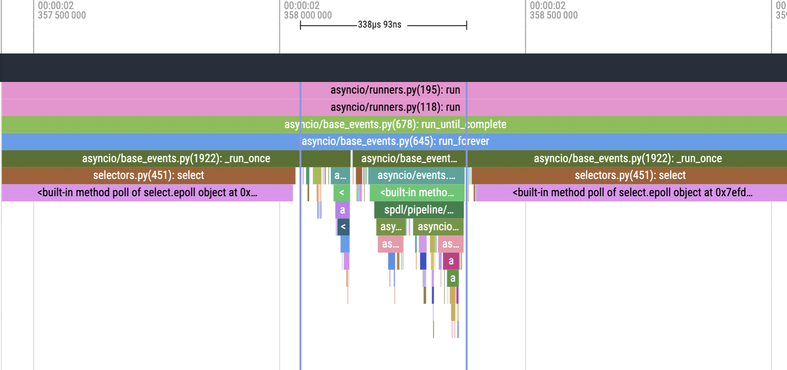

The ``async`` and ``await`` keywords
====================================

In Async I/O, a unit of task is defined with ``async def`` and
``await`` keywords.

A function defined with ``async def`` returns a coroutine object.
The event loop schedules a coroutine execution and reacts to its completion.
The mechanism around these keywords are generic in the sense that it
does not dictate how the actual asynchronousness is realized.

It is expected that the actual work is done in non-blocking manner,
but there is no constraint in what mechanism should realize
the non-blocking property.
One can use multi-threading, multi-processing or some other mechanism.
The event loop is only concerned about how to start a task and how to
react to its completion.

The contract of how the event loop and coroutines interact is defined
via `await expression <https://docs.python.org/3/glossary.html#term-awaitable>`_.
Objects implement ``__await__`` method are called awaitable.

The :py:class:`concurrent.futures.Future` objects
(returned when submitting a job to an executor)
can be converted to awaitable (:py:class:`asyncio.Future`),
so async I/O can also run synchronous functions using
multi-threadin/multi-processing.

The ``aync def`` and ``await`` expression allows to write coroutine
in a way very similar to synchronous procedure.
This makes it easy to write a complex execution flow,
such as occasionally running multiple tasks concurrently,
then waiting for the completion, alongside other ongoing tasks.
However since it mixes synchronous code and asynchronous code, and
the synchronous part is directly executed by the event loop,
it is easy to prevent the event loop from progressing the asynchronous
operations (reacting to task completions).

It is very important that
**time-consuming synchronous operations are not directly executed in coroutine.**
In other words,
**such synchronous operaitons must be delegated to an executor.**

Let's look at a toy example of ``async def`` and ``await``, and how
the event loop process them.

.. code-block::

   async def some_task(...):
       ...

   async def wrapper(...):
       preparation()  # sync
       await some_task()
       finalization()  # sync

A function that is defined with ``async def`` is called a coroutine function
because it returns a coroutine object.
In above example both ``some_task`` and ``wrapper`` return a coroutine object.

Each coroutine object has ``__await__`` method.
The event loop will process coroutine objects with ``await`` keyword.

When a coroutine is awaited, roughly the following things happen.

1. The event loop schedules the execution of the coroutine.
2. The event loop register the coroutine for callback.
3. The event loop goes back to the state where it waits for a task completion.

So far, this is aligned with what we have seen.
Now we look at how the event loop process the inner implementation of
coroutine function.

1. Synchronous blocks are executed by the event loop itself.
2. Therefore, the thread running the event loop is blocked by any synchronous code in coroutine.
3. While the above happens the event loop cannot react to any task completion.

Let's look at the trace of the event loop from the previous section.

The event loop is at stand-by when it's blocked on :py:meth:`selectors.BaseSelector.select`.
When a task is completed, then it exits the ``select`` call, and execute a callback.

The callback in this case is :py:meth:`spdl.pipeline.PipelineBuilder.pipe` method,
and it's submitting a synchronous function to a thread pool, then converting the resulting
:py:class:`concurrent.futures.Future` object into :py:class:`asyncio.Future` object.

While the callback is being executed, the event loop is not able to react to another
task completion.

If a code is properly written, the callback is very quick, so it does not introduce a delay.
However, if this callback is time-consuming, it will block the event loop for significant
amount of time, preventing it from reacting to completed tasks.
It eventually delays the entire orchestration.
This can happen in number of subtle ways.
It could be simple oversight, could be that a function was unexpectedly taking longer, or
a function is holding the GIL.
