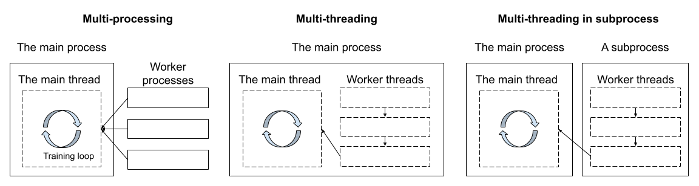

Parallelism and Performance
===========================

.. admonition:: tl;dr
   :class: tip

   If using multi-threading degrades the performance of a training pipeline
   even though the performance of individual functions are good,
   run the data loader in a subprocess.

   You can use :py:func:`spdl.pipeline.run_pipeline_in_subprocess` to run
   the pipeline in a subprocess.

With the introduction of free-threaded Python, the use of multi-threading
will become undoubtedly common.

When we started SPDL, we thought multi-threading would solve all the data
loading inefficiencies.
However, we encountered a case where simply applying multi-threading
(while properly releasing the GIL) degraded the performance.
We would like to share our experiences and thoughts on parallelism and performance.

.. note::

   To learn about the use of different parallelism with SPDL, please
   refer to the `Getting Started / Parallelism <../getting_started/parallelism.html>`_.

Pipeline Speed
--------------

The following plot shows the training QPS (the inverse of step time) of the pipeline.

- The ``baseline`` is the original implementation, which is based on TorchData's
  ``StatefulDataLaoder``.
- The ``headspace`` is the upper limit obtained by using
  :py:class:`~spdl.dataloader.CacheDataLoader`.
  (See `Headspace Analysis <../optimization_guide/headspace_analysis.html>`_.)
- The ``mt`` is the solution based on simple multi-threading.
- The ``mtp`` is the optimized solution, where the pipeline (multi-threaded) is
  executed in a subprocess.

.. raw:: html

   

The baseline can process approximately 2.4 batches per second.
The headspace analysis suggests the maximum performance we can get is around 4.2.

This suggests that there is enough room for data loading improvement,
so we tried SPDL with multithreading.
To our surprise, the speed dropped to 1.2 batches per second.

Inconsistent Performance
------------------------

What confused us was that the other performance metrics from the model part
were not consistent with the overall performance drop.
The following plots show the average time for the backward path and optimizer step.

.. raw:: html

   

.. raw:: html

   

We did not make any changes to the model architecture or loss
when we swapped the data loader.
The backward path and the optimizer step appear to be faster than the
baseline.
However, since the ``mt`` run is overall slower, this suggests that
other model computation parts are slower for the ``mt`` run.
(We do not have breakdown for forward path.)
We can also see that the ``mt`` run shows spikier behavior than the others.

Noisy Neighbour and multiprocessing
-----------------------------------

After many failed attempts to resolve this, we suspected it could be
due to `the Noisy Neighbour <../optimization_guide/noisy_neighbour.html>`_,
even though the CPU utilization of the ``mt`` run is a little above 20%,
whereas the baseline run uses more than 60%.
(PyTorch DataLoader uses multiprocessing in very inefficient manner.)

The core issue of the noisy neighbour is that
the CPU cannot launch the GPU kernel in a timely manner.
The CPU task scheduling is handled by the OS, and
there is a great deal to this topic,
but what we could do with a little effort was to move the pipeline parallelism
out of the main process and execute it in a dedicated subprocess.

The following figure illustrates this.

It turned out that this multi-threading in subprocess (``mtp``) is
highly effective.
It consumed a little more CPU resources (~26%) than simple ``mt`` (~20%),
but it was faster, and no spiky behavior was observed.

.. include:: ../plots/parallelism.txt
