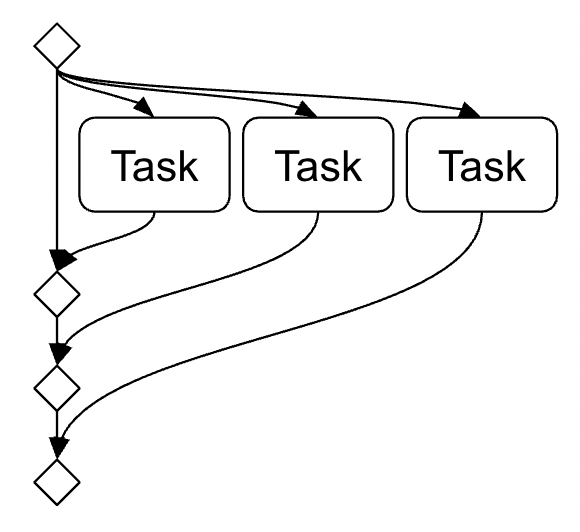

Introduction to Async
=====================

Asynchronous operations (a.k.a. async I/O) are the foundation of SPDL,
but many ML practitioners are not familiar with such programming paradigm.

For advanced usage of SPDL, it is often necessary to use async IO,
but care must be taken as improper usage can slow down the whole system.

In this section, we share our view of what problem async I/O solves and how
it evolved from concurrent programming in synchronous domain, in the hope
it helps you understand how async I/O (thus the internal of SPDL pipeline)
works and it lets you take advantage of it.

Concurrent execution and Future
-------------------------------

.. py:currentmodule:: concurrent.futures

Let's say, we have multiple tasks that we want to complete as soon as possible.
(For the sake of simplicity, let's pretend that the tasks are independent each
other so we don't need to think about synchronization and such.)

There are multiple ways to concurrently process them.
Python's :py:mod:`concurrent.futures` module offers
:py:class:`ThreadPoolExecutor` and :py:class:`ProcessPoolExecutor`.
There are different constraints when using multi-threading and multi-processing,
but that is not the main concern here, and we will come back to that later.

The steps to run tasks with thread/process pool executor are as following.

1. Submit a task to the executor.
2. Wait for the task to complete.
3. Check whether the job succeeded or not.

The following code snippet† illustrates this

.. code-block::

   # 0. Create a thread pool executor. †
   executor = ThreadPoolExecutor(max_workers=...)

   # 1. Submit a task
   future = executor.submit(fn, ...)

   # 2. Wait for the task to complete.
   # The code can do other things meanwhile.
   ...

   # 3. Attend to the completion and check the result.
   try:
       result = future.result()
   except Exception:
       # Task failed
       ...
   else:
       # Task succeeded
       ...

.. note::

   When using executor, it is advised to use a context manager to
   properly shutdown it.
   Here, it is omitted for brevity.

It uses a thread to execute the task and the main thread waits its completion.

.. image:: ../_static/data/concurrent_1.png
   :width: 180

Difficulty with composing futures
---------------------------------

Now let's try to make the scenario closer to the real-world application; concurrent
task execution. It reveals many awkwardness when we aim to achieve high throughput
with more than one concurrency.

Pipelining Attempt
------------------

Since data loading is composed of operations with different bounding factors
(such as network bandwidth, compute resource, and memory bandwidth),
we want to split the data loading procedure into small units and pipeline them.

We can extend the previous example by attaching the next step when the task
completed successfully.

.. code-block::

   future1 = executor.submit(fn1, ...)
   try:
       result1 = future1.result()
   except Exception:
       ...
   else:
       future2 = executor.submit(fn2, result1, ...)
       try:
           result2 = future2.result()
       except Exception:
           ...
       else:
           future3 = executor.submit(fn3, result2, ...)
           try:
               result3 = future3.result()
           except Exception:
               ...
           else:
               ...

The cyclomatic complexity of the code increased a lot.
It resembles the notorious issue of callback hell, which was quite common
in JavaScript before the invention of promise chaining and async/await.
(In fact, this tutorial is reliving the evolution of asynchronous
programming paradigm, though we skip the intermediate and go straight to async I/O)

If we squash error handlings, then this could be simplified
like the following, which makes it easy to see the more fundamental issue.

.. code-block::

   try:
       future1 = executor.submit(task1, ...)
       result1 = future1.result()  # blocking
       future2 = executor.submit(task2, result1, ...)
       result2 = future2.result()  # blocking
       future3 = executor.submit(task3, result2, ...)
       result3 = future3.result()  # blocking
   except Exception:
       ...

We need to attend to the completion with :py:meth:`Future.result` method,
but since this method is blocking, at most only one such approach can be used at a time.
In other words, even when we wrap this code into a function, we cannot execute multiple
of it concurrently.

So we are not really executing tasks concurrently.

Running multiple pipelines
--------------------------

If we want to process multiple tasks concurrently, we can submit multiple tasks as follow.

.. code-block::

   futures = [executor.submit(func, item) for item in items]

This code snippet may look like a simple extension of the original one, but this change
introduces many complications.

The first concern is execution time. We cannot assume that the tasks complete in
the order they are scheduled. To maximize the throughput of the pipeline, we want to
react to the tasks in the order they complete, and as soon as possible.

Fortunately, there is a out-of-box solution for this.
The :py:func:`concurrent.futures.wait` function can attend to multiple of
:py:class:`concurrent.futures.Future` objects and return when one of them is completed.

.. code-block::

   futures = {executor.submit(task...) for task in tasks}

   while futures:
       done, futures = wait(futures, return_when=FIRST_COMPLETED)

       for future in done:
           try:
               result = future.result()
           except Exception:
               # A task failed
               ...
           else:
               # A task succeeded
               ...

.. image:: ../_static/data/concurrent_3.png
               
Now, let's try to build pipeline on top of it.
Say the tasks we invoked in the previous example represent the first step
of data loading pipeline, we can invoke the next step when they succeed.

Say we have some magical helper function ``get_next_task`` which returns
a function for the next stage, and ``None`` if there is no next stage.

We can extend the pipeline like the following.

.. code-block::
 
   futures = {executor.submit(task...) for task in tasks}

   while futures:
       done, futures = wait(tasks, return_when=FIRST_COMPLETED)

       for future in done:
           try:
               result = future.result()
           except Exception:
               # A task failed
               ...
           else:
               # A task succeed
               # Check and fetch the next stage
               if (task_fn := get_next_task(result)) is not None:
                   # Invoke
                   future = executor.submit(task_fn, result)
                   futures.add(future)

                   
This approach accomplishes the basic pipelining, but it only runs the pipeline
for the items submitted at the beginning. We want to start running pipelines for
more items as the current ones complete.
We also want to assign different concurrency for different stages.
For example, GPUs do not support transferring multiple data concurrently so
we want to have at most one transfer task anytime.
It is not straightforward to add such features.

The event loop
--------------

We can keep going, but let's pause here and look at what we have.
Even though our code is not feature-complete, it is already complex
and likely maintaining it is error-prone.

One interesting aspect of the code is that it is task-agnostic.
The task functions are usually provided by library users.
There is nothing specific about the task being handled.

From the perspective of performance, we need to make sure that this code does
not introduce any delay. The code we have here is all about orchestrating the
user-provided functions, and it needs to be efficiently.

This is a very common problem, especially when building server-type system.
The programming paradigm has evolved to solve this, and async I/O is one of them.

In async I/O, there is a notion of event loop, which does a similar thing
as the code snippet we saw, but more efficiently and provides more flexibility.
The event loop is responsible for **scheduling tasks** and
**reacting when a task completes**.

The following diagram is our attempt at depicting the features of event loop
in a similar flow chart as before.

.. image:: ../_static/data/event_loop.png

The event loop does not wait for a particular future to complete, instead,
it is notified when one completes, and reacts to it.

It supports complex execution flow like branching to multiple tasks and
waiting for multiple tasks.
The later involves waiting for a particular task explicitly.

The event loop is generic in the sense that the way it starts tasks
and reacts to the completion follows the Future-like object protocol
(i.e. the ``__await__`` method [`ref <https://peps.python.org/pep-0492/#await-expression>`_]).
There is no constraints for the implementation of ``__await__`` that
necessitates the use of multi-threading or multi-processing, but it is
possible to convert :py:class:`concurrent.futures.Future` objects
into awaitable (:py:class:`asyncio.Future`), meaning that it is possible
to execute synchronous function as asynchronous function by using
multi-threading or multi-processing.

The ``async`` and ``await`` keywords
------------------------------------
