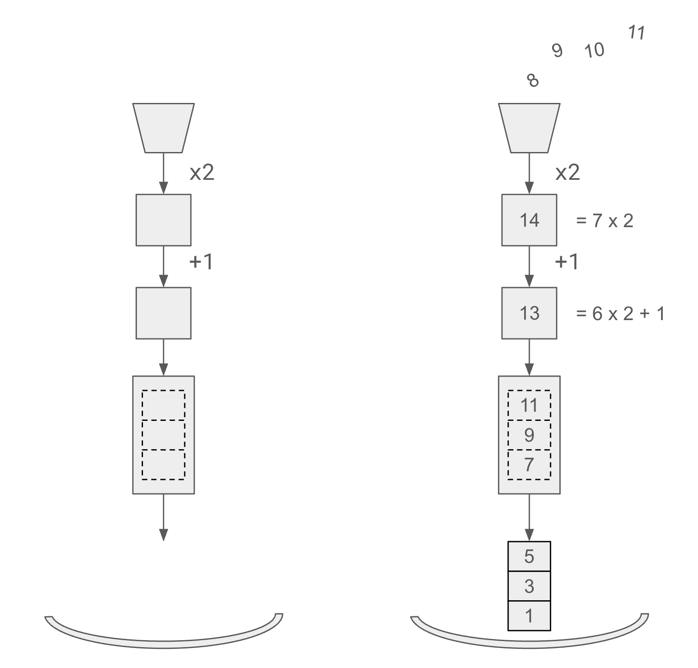

.. _intro:

Building and Running Pipeline
=============================

.. py:currentmodule:: spdl.pipeline

Building a Pipeline
-------------------
                      
First, let's look at how easy it is to build the pipeline in SPDL.

The following snippet demonstrates how one can construct a
:py:class:`Pipeline` object using a :py:class:`PipelineBuilder` object.

.. code-block::

   >>> from spdl.pipeline import PipelineBuilder
   >>>
   >>> pipeline = (
   ...     PipelineBuilder()
   ...     .add_source(range(12))
   ...     .pipe(lambda x: 2 * x)
   ...     .pipe(lambda x: x + 1)
   ...     .aggregate(3)
   ...     .add_sink(3)
   ...     .build(num_threads=1)
   ... )

The resulting :py:class:`Pipeline` object contains all the logic to
perform the operations in an async event loop in a background thread.

Running a Pipeline
------------------
                      
To run the pipeline, call :py:meth:`Pipeline.start`.
Once the pipeline starts executing, you can iterate on the pipeline.
Finally call :py:meth:`Pipeline.stop` to stop the background thread.

.. code-block::

   >>> pipeline.start()
   >>>
   >>> for item in pipeline:
   ...     print(item)
   [1, 3, 5]
   [7, 9, 11]
   [13, 15, 17]
   [19, 21, 23]
   >>> pipeline.stop()

It is important to call :py:meth:`Pipeline.stop`.
Forgetting to do so will leave the background thread running,
leading to the situation where Python interpreter gets stuck at exit.

In practice, there is always a possibility that the application is
interrupted for unexpected reasons.
To make sure that the pipeline is stopped, it is recommended to use
:py:meth:`Pipeline.auto_stop` context manager, which calls
``Pipeline.start`` and ``Pipeline.stop`` automatically.

.. code-block::

   >>> with pipeline.auto_stop():
   ...    for item in pipeline:
   ...        print(item)

.. note::

   Once :py:meth:`Pipeline.stop` method is called, the ``Pipeline`` object is unusable.
   To pause the execution, simply stop consuming the output.
   The ``Pipeline`` will get blocked when the internal buffers are full.
   To resume the execution, resume consuming the data.

.. _pipeline-caveats:
   
⚠ Caveats ⚠
-----------

Unlike processes, threads cannot be killed.
The ``Pipeline`` object uses a thread pool, and it is important to
shutdown the thread pool properly.

There are seemingly unharmful patterns, which can cause a deadlock
at the end of the Python interpreter, preventing Python from exiting.

.. admonition:: Keeping unnecessary references to ``Pipeline``
   :class: danger

   It is recommended to keep the resulting ``Pipeline`` object as a
   local variable of an interator, and NOT TO assign it to an object
   attribute.

   .. code-block::

      class DataLoader:
          ...

          def __iter__(self) -> Iterator[T]:
              # 👍 Leave the `pipeline` variable as a local variable.
              pipeline = self.get_pipeline(...)
              # So that the `pipeline` will get garbage collected after the
              # iterator goes out of the scope.

              with pipeline.auto_stop():
                  yield from pipeline.get_iterator(...)

              # The reference count of the `pipeline` object goes to zero
              # here, so it will be garbage collected.

   .. code-block::

      class DataLoader:
          ...

          def __iter__(self) -> Iterator[T]:
              # 🚫 Do not assign the pipeline to the object.
              self.pipeline = self.get_pipeline(...)
              #
              # The pipeline won't get garbage collected until
              # the DataLoader instance goes out of scope,
              # which might cause dead-lock when Python tries to exit.

              with self.pipeline.auto_stop():
                  yield from self.pipeline.get_iterator(...)

              # The `pipeline` object won't get garbage collected here.

.. admonition:: Calling ``iter`` on Pipeline
   :class: danger

   We recommend to not call the :py:func:`iter` function
   on a ``Pipeline`` object.
   It can prevent the :py:meth:`Pipeline.stop` method from being called
   at the right time.
   It in turn might make the Python interpreter hange at exit.

   Say you wrap a ``Pipeline`` to create an class that resembles conventional
   ``DataLoader``.

   .. code-block:: python

      class DataLoader(Iterable[T]):
          ...

          def __iter__(self) -> Iterator[T]:
              pipeline = self.get_pipeline()
              with pipeline.auto_stop():
                  for item in pipeline:
                      yield item

      dataloader = DataLoader(...)

   When using this instance, make sure to not leave the iterator object
   hanging around.
   That is, the usual for-loop is good.

   .. code-block:: python

      # 👍 The iterator is garbage collected soon after the for-loop.
      for item in dataloader:
          ...
      # the pipeline will be shutdown at the end of the for-loop.

   This way, the context manager properly calls ``Pipeline.stop`` when
   the execution flow goes out of the loop, even
   when the application is exiting with unexpected errors.

   The following code snippet shows an anti-pattern where the iterator
   object is assigned to a variable, which delays the shutdown of
   the thread pool.

   .. code-block:: python

      # 🚫 Do not keep the iterator object around
      ite = iter(dataloader)
      item = next(ite)
      # the won't be shutdown won't be shutdown until the `ite` variable
      # goes out of scope. When does that happen??

   The ``Pipeline.stop`` is not called until the garbage collector deletes
   the object.
   It might cause a deadlock, and prevents Python interpreter from
   exiting.
