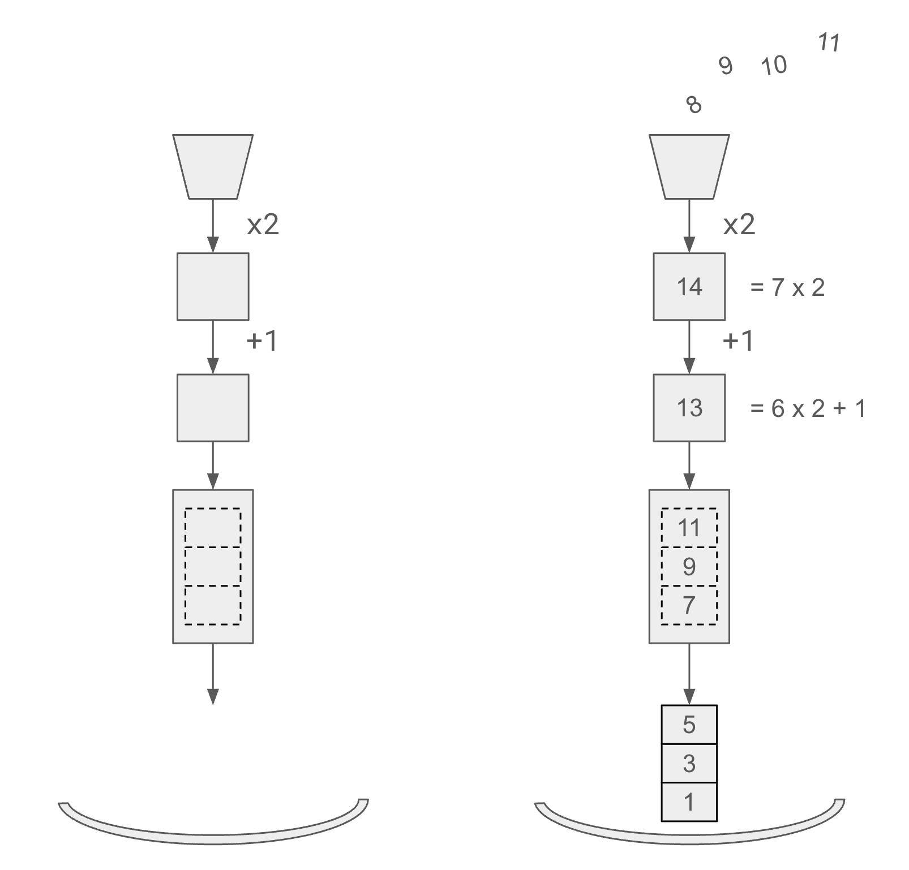

.. _intro:

Building and Running Pipeline
=============================

.. py:currentmodule:: spdl.pipeline

Building a Pipeline
-------------------

First, let's look at how easy it is to build the pipeline in SPDL.

The following snippet demonstrates how one can construct a
:py:class:`Pipeline` object using a :py:class:`PipelineBuilder` object.

.. code-block::

   >>> from spdl.pipeline import PipelineBuilder
   >>>
   >>> pipeline = (
   ...     PipelineBuilder()
   ...     .add_source(range(12))
   ...     .pipe(lambda x: 2 * x)
   ...     .pipe(lambda x: x + 1)
   ...     .aggregate(3)
   ...     .add_sink(3)
   ...     .build(num_threads=1)
   ... )

The resulting :py:class:`Pipeline` object contains all the logic to
perform the operations in an async event loop in a background thread.

Running a Pipeline
------------------

.. note::

   The v0.4.0 introduced the experimental automatic start and stop.
   The :py:meth:`Pipeline.get_item` method ensures that the background
   thread is started, and the :py:meth:`Pipeline.stop` method is called
   when the Pipeline object is garbage collected.

   You should be simply able to do ``for item in pipeline:``.
   Please file an issue if you find any problems with the automatic start
   and stop.

   If you need to control the resource usage, then you can explicitly call
   :py:meth:`start` and `stop`.

To run the pipeline, call :py:meth:`Pipeline.start`.
Once the pipeline starts executing, you can iterate on the pipeline.
Finally call :py:meth:`Pipeline.stop` to stop the background thread.

.. code-block::

   >>> pipeline.start()
   >>>
   >>> for item in pipeline:
   ...     print(item)
   [1, 3, 5]
   [7, 9, 11]
   [13, 15, 17]
   [19, 21, 23]
   >>> pipeline.stop()

Calling :py:meth:`Pipeline.stop` promptly is good practice: it releases the
background thread and any worker processes as soon as you are done, instead of
leaving them running until the object is garbage collected. It is no longer
required to avoid a hang at exit, though — a ``Pipeline`` stops itself when it is
garbage collected, and :py:meth:`Pipeline.start` additionally registers a hook
that stops any still-running pipeline at interpreter shutdown (see
:py:meth:`Pipeline.start` for details).

In practice, there is always a possibility that the application is
interrupted for unexpected reasons.
To make sure that the pipeline is stopped, it is recommended to use
:py:meth:`Pipeline.auto_stop` context manager, which calls
``Pipeline.start`` and ``Pipeline.stop`` automatically.

.. code-block::

   >>> with pipeline.auto_stop():
   ...    for item in pipeline:
   ...        print(item)

.. note::

   Once :py:meth:`Pipeline.stop` method is called, the ``Pipeline`` object is unusable.
   To pause the execution, simply stop consuming the output.
   The ``Pipeline`` will get blocked when the internal buffers are full.
   To resume the execution, resume consuming the data.

.. _pipeline-caveats:

⚠ Caveats ⚠
-----------

Unlike processes, threads cannot be killed.
The ``Pipeline`` object uses a thread pool, which must be shut down properly.

The library cleans a ``Pipeline`` up automatically (see below), so these
patterns no longer hang the interpreter at exit. They can still keep the
background thread and worker processes alive longer than necessary, so they are
worth avoiding for prompt resource release.

.. admonition:: Holding a reference to a ``Pipeline``
   :class: note

   A ``Pipeline`` cleans itself up automatically, so holding a reference to one
   is safe. When the object is garbage collected, a ``weakref.finalize`` drains
   and stops its background thread — and any worker processes or subinterpreters
   it spawned — even if you never called :py:meth:`Pipeline.stop`. And if a
   reference survives until the program ends, :py:meth:`Pipeline.start` has
   registered a hook that stops any still-running pipeline at the very start of
   interpreter finalization, so the process does not hang at exit (see
   :py:meth:`Pipeline.start` for how that ordering works). Holding a reference is
   in fact **required** to re-iterate a ``continuous=True`` source across epochs:
   the same ``Pipeline`` must stay alive to be iterated again.

   You should still release the reference (or call :py:meth:`Pipeline.stop`) once
   you are done, so the worker processes and memory are freed promptly rather than
   lingering until GC — but this is resource hygiene, not a requirement to avoid a
   hang.

   .. code-block::

      class DataLoader:
          def __init__(self) -> None:
              # Safe (and, for a continuous source, required) to keep the
              # pipeline as an attribute so it is reused across epochs.
              self._pipeline = self.get_pipeline(...)

          def __iter__(self) -> Iterator[T]:
              yield from self._pipeline.get_iterator(...)

          def close(self) -> None:
              # Optional: drop the reference when done so the pipeline's
              # resources are freed promptly instead of at GC / interpreter exit.
              self._pipeline = None

   Some frameworks stash the dataloader on a long-lived object.
   `TorchTNT <https://pytorch.org/tnt/>`_, for example, keeps a strong reference
   to the dataloader on its ``State`` (``PhaseState._dataloader``) until the
   process exits. This no longer hangs the run — the shutdown hook cleans the
   pipeline up at exit — but if you want its worker processes and memory released
   as soon as training ends (e.g. between fit and eval) rather than at exit, you
   can clear those references and force a collection with a callback:

   .. code-block:: python

      import gc

      from torchtnt.framework.callback import Callback
      from torchtnt.framework.state import State
      from torchtnt.framework.unit import TEvalUnit, TPredictUnit, TTestUnit, TTrainUnit

      class DetachDataloaderCallback(Callback):
          """Optional: drop TNT's dataloader references at the end of training so
          the SPDL ``Pipeline`` (and its workers) are released promptly, instead of
          lingering on ``State`` until the pipeline is cleaned up at exit."""

          def on_train_end(self, state: State, unit: TTrainUnit) -> None:
              self._detach(state)

          def on_exception(
              self,
              state: State,
              unit: TTrainUnit | TEvalUnit | TPredictUnit | TTestUnit,
              exc: BaseException,
          ) -> None:
              # on_train_end does not fire on failure/preemption, so reap here too.
              self._detach(state)

          def _detach(self, state: State) -> None:
              for phase_state in (state.train_state, state.eval_state):
                  if phase_state is not None:
                      phase_state._dataloader = None  # pyre-ignore[8]
              gc.collect()

.. admonition:: Calling ``iter`` on Pipeline
   :class: note

   Prefer not to call the :py:func:`iter` function on a ``Pipeline`` object and
   keep the resulting iterator around. Doing so delays :py:meth:`Pipeline.stop`
   until the iterator is collected, keeping the background thread and worker
   processes running longer than necessary. (It will not hang the interpreter at
   exit — the hook registered by :py:meth:`Pipeline.start` covers that — but it
   holds resources needlessly.)

   Say you wrap a ``Pipeline`` to create a class that resembles conventional
   ``DataLoader``.

   .. code-block:: python

      class DataLoader(Iterable[T]):
          ...

          def __iter__(self) -> Iterator[T]:
              pipeline = self.get_pipeline()
              with pipeline.auto_stop():
                  for item in pipeline:
                      yield item

      dataloader = DataLoader(...)

   When using this instance, make sure to not leave the iterator object
   hanging around.
   That is, the usual for-loop is good.

   .. code-block:: python

      # 👍 The iterator is garbage collected soon after the for-loop.
      for item in dataloader:
          ...
      # the pipeline will be shutdown at the end of the for-loop.

   This way, the context manager properly calls ``Pipeline.stop`` when
   the execution flow goes out of the loop, even
   when the application is exiting with unexpected errors.

   The following code snippet shows an anti-pattern where the iterator
   object is assigned to a variable, which delays the shutdown of
   the thread pool.

   .. code-block:: python

      # 🚫 Do not keep the iterator object around
      ite = iter(dataloader)
      item = next(ite)
      # the pipeline won't be shutdown until the `ite` variable
      # goes out of scope. When does that happen??

   Until then, ``Pipeline.stop`` is deferred to whenever the garbage collector
   deletes the object, so the background thread and workers keep holding
   resources longer than needed.
