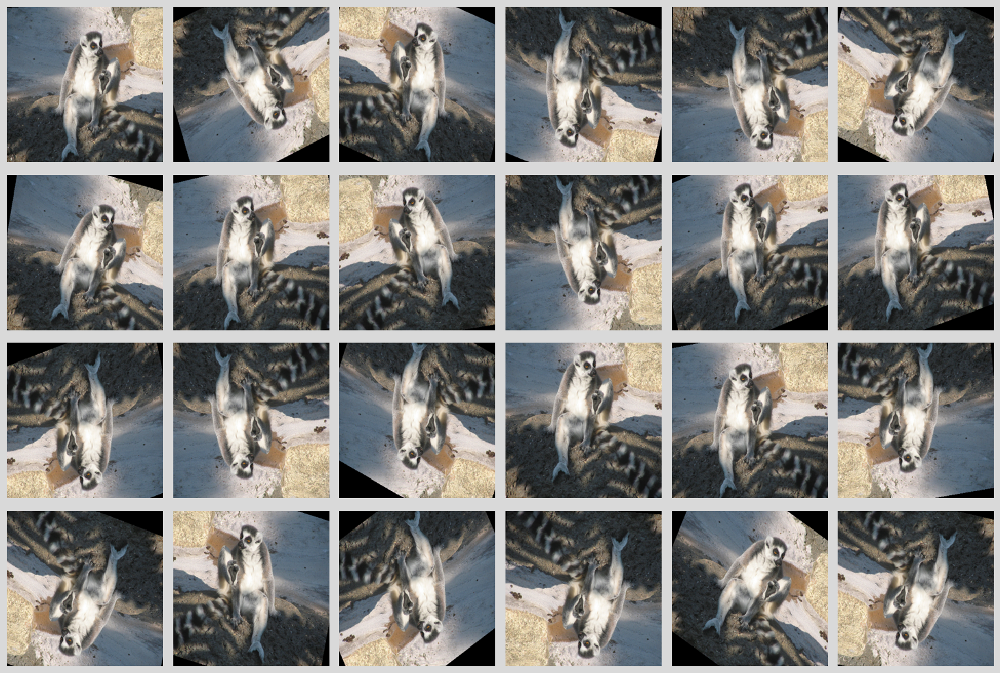

Filter Graphs
=============

This section explains how to use filters to customize the decoding process in SPDL.
Filters allow you to transform media data during decoding, which can be more efficient than post-processing.

FFmpeg Filters Overview
-----------------------

FFmpeg filters are processing operations that transform audio or video frames.
Filters can perform operations like:

- Format conversion (YUV to RGB, sample format changes)
- Resizing and scaling
- Cropping
- Rotation and flipping
- Color adjustments
- Audio resampling
- And many more...

For a complete list of available filters, see the `FFmpeg Filters Documentation <https://ffmpeg.org/ffmpeg-filters.html>`_.

Filter Descriptions
-------------------

In SPDL, you can specify the filtering with a string that follows
FFmpeg's filter graph description syntex.

**Basic syntax:**

.. code-block:: text

   filter1=param1=value1:param2=value2,filter2,filter3=param=value

Filters are separated by commas (``,``), and parameters within a filter are separated by colons (``:``) using ``key=value`` format.

**Example filter descriptions:**

.. code-block:: python

   # Scale video to 256x256 and convert to RGB
   "scale=256:256,format=rgb24"

   # Resample audio to 16kHz mono
   "aresample=16000,pan=mono|c0=c0"

   # Crop, rotate, and flip
   "crop=224:224:0:0,rotate=30*PI/180,hflip"

Helper Functions
----------------

SPDL provides helper functions to construct filter descriptions for common use cases.
These functions handle the complexity of filter syntax and ensure correct parameter formatting.

get_audio_filter_desc
~~~~~~~~~~~~~~~~~~~~~

:py:func:`spdl.io.get_audio_filter_desc` generates filter descriptions for audio processing.

**Parameters:**

- ``sample_rate``: Target sample rate (Hz)
- ``num_channels``: Target number of channels
- ``sample_fmt``: Target sample format (e.g., ``"fltp"``, ``"s16p"``)
- ``num_frames``: Exact number of frames to output (pads or trims as needed)
- ``timestamp``: Time window to extract (tuple of start and end times)
- ``filter_desc``: Additional custom filters to apply

**Example:**

.. code-block:: python

   import spdl.io

   # Resample to 16kHz, convert to mono, 16-bit integer
   filter_desc = spdl.io.get_audio_filter_desc(
       sample_rate=16_000,
       num_channels=1,
       sample_fmt="s16p"
   )
   # Result: "aformat=channel_layouts=1c,aresample=16000,aformat=sample_fmts=s16p"

   # Extract 5 seconds starting at 10 seconds
   filter_desc = spdl.io.get_audio_filter_desc(
       timestamp=(10.0, 15.0),
       sample_rate=16_000
   )

   # Use in decoding
   packets = spdl.io.demux_audio("audio.mp3")
   frames = spdl.io.decode_packets(packets, filter_desc=filter_desc)

get_video_filter_desc
~~~~~~~~~~~~~~~~~~~~~

:py:func:`spdl.io.get_video_filter_desc` generates filter descriptions for video/image processing.

**Parameters:**

- ``frame_rate``: Target frame rate (frames per second or tuple of numerator/denominator)
- ``scale_width``, ``scale_height``: Target dimensions for scaling
- ``scale_algo``: Scaling algorithm (``"bilinear"``, ``"bicubic"``, ``"lanczos"``, etc.)
- ``scale_mode``: How to handle aspect ratio (``"stretch"``, ``"pad"``, ``"crop"``)
- ``crop_width``, ``crop_height``: Dimensions for center cropping
- ``pix_fmt``: Target pixel format (e.g., ``"rgb24"``, ``"yuv420p"``)
- ``num_frames``: Exact number of frames to output
- ``pad_mode``: How to pad if fewer frames than requested (``"black"``, ``"repeat_last"``)
- ``timestamp``: Time window to extract
- ``filter_desc``: Additional custom filters to apply

**Example:**

.. code-block:: python

   import spdl.io

   # Scale to 256x256, convert to RGB
   filter_desc = spdl.io.get_video_filter_desc(
       scale_width=256,
       scale_height=256,
       pix_fmt="rgb24"
   )

   # Scale with padding to preserve aspect ratio
   filter_desc = spdl.io.get_video_filter_desc(
       scale_width=256,
       scale_height=256,
       scale_mode="pad",
       pix_fmt="rgb24"
   )

   # Extract 30 frames at 30fps, scale and crop
   filter_desc = spdl.io.get_video_filter_desc(
       frame_rate=30,
       scale_width=256,
       scale_height=256,
       crop_width=224,
       crop_height=224,
       num_frames=30,
       pix_fmt="rgb24"
   )

   # Use in decoding
   packets = spdl.io.demux_video("video.mp4")
   frames = spdl.io.decode_packets(packets, filter_desc=filter_desc)

get_filter_desc
~~~~~~~~~~~~~~~

:py:func:`spdl.io.get_filter_desc` is a convenience function that automatically selects the appropriate helper based on the packet type.

**Example:**

.. code-block:: python

   import spdl.io

   # Automatically uses get_video_filter_desc
   packets = spdl.io.demux_video("video.mp4")
   filter_desc = spdl.io.get_filter_desc(
       packets,
       scale_width=256,
       scale_height=256
   )

   # Automatically uses get_audio_filter_desc
   packets = spdl.io.demux_audio("audio.mp3")
   filter_desc = spdl.io.get_filter_desc(
       packets,
       sample_rate=16_000
   )

Custom Filter Descriptions
---------------------------

For advanced use cases, you can write custom filter descriptions or
combine them with the helper functions.

Writing Custom Filters
~~~~~~~~~~~~~~~~~~~~~~~

You can write filter descriptions manually as strings:

.. code-block:: python

   import spdl.io

   # Custom filter: horizontal flip, rotate 45 degrees, scale
   custom_filter = "hflip,rotate=45*PI/180,scale=256:256"

   packets = spdl.io.demux_video("video.mp4")
   frames = spdl.io.decode_packets(packets, filter_desc=custom_filter)

.. image:: ../_static/data/io_basic_filtergraph.png

Combining with Helper Functions
~~~~~~~~~~~~~~~~~~~~~~~~~~~~~~~~

The helper functions accept a ``filter_desc`` parameter to insert custom filters:

.. code-block:: python

   import spdl.io

   # Add custom filters before format conversion
   filter_desc = spdl.io.get_video_filter_desc(
       filter_desc="hflip,vflip",  # Custom filters applied first
       scale_width=256,
       scale_height=256,
       pix_fmt="rgb24"  # Format conversion applied last
   )

   # Result: "hflip,vflip,scale=256:256,format=rgb24"

**Important:** When using ``timestamp`` parameter with custom filters, ensure your custom filters don't interfere with the trimming filters that SPDL adds automatically.

Common Filter Examples
----------------------

Video Filters
~~~~~~~~~~~~~

**Horizontal and vertical flip:**

.. code-block:: python

   filter_desc = "hflip,vflip"

**Rotation:**

.. code-block:: python

   # Rotate 90 degrees clockwise
   filter_desc = "rotate=90*PI/180"

   # Rotate with variable angle
   angle_rad = 45 * 3.14159 / 180
   filter_desc = f"rotate={angle_rad}"

**Brightness and contrast:**

.. code-block:: python

   # Increase brightness by 0.1, contrast by 1.2
   filter_desc = "eq=brightness=0.1:contrast=1.2"

**Gaussian blur:**

.. code-block:: python

   filter_desc = "gblur=sigma=2"

**Random crop:**

.. code-block:: python

   import random

   # Note: crop_x and crop_y are not supported by get_video_filter_desc.
   # Cropping is always center-based. For custom crop positions,
   # use get_filter_desc with a custom crop filter.

   x_pos = random.random()  # 0.0 to 1.0
   y_pos = random.random()

   # Center crop only (no positional control)
   filter_desc = spdl.io.get_video_filter_desc(
       scale_width=256,
       scale_height=256,
       crop_width=224,
       crop_height=224,
       pix_fmt="rgb24"
   )

Audio Filters
~~~~~~~~~~~~~

**Volume adjustment:**

.. code-block:: python

   # Increase volume by 50%
   filter_desc = "volume=1.5"

**High-pass filter:**

.. code-block:: python

   # Remove frequencies below 200 Hz
   filter_desc = "highpass=f=200"

**Tempo change:**

.. code-block:: python

   # Speed up by 1.5x
   filter_desc = "atempo=1.5"

Data Augmentation with Filters
-------------------------------

Filters are particularly useful for data augmentation during training.
Applying filters to decoded frames before buffer conversion can be more memory-efficient
than applying the same operations after creating a contiguous array.

Random Augmentation Example
~~~~~~~~~~~~~~~~~~~~~~~~~~~~

Filters can be generated with random parameters for data augmentation.
The following example shows how to change augmentation values dynamically.

.. code-block:: python

   import random
   import spdl.io

   def get_random_augmentation_filter():
       """Generate a random augmentation filter for images."""
       filters = []

       # Random horizontal flip (50% chance)
       if random.random() < 0.5:
           filters.append("hflip")

       # Random vertical flip (50% chance)
       if random.random() < 0.5:
           filters.append("vflip")

       # Random rotation (-30 to +30 degrees)
       angle = (random.random() * 60 - 30) * 3.14159 / 180
       filters.append(f"rotate={angle:.3f}")

       # Combine custom filters with standard preprocessing
       custom_filters = ",".join(filters)

       # Note: For custom crop positions, include crop filter in filter_desc
       # get_video_filter_desc only supports center cropping via crop_width/crop_height
       return spdl.io.get_video_filter_desc(
           filter_desc=custom_filters,
           scale_width=256,
           scale_height=256,
           crop_width=224,
           crop_height=224,
           pix_fmt="rgb24"
       )

   def load_image_with_augmentation(image_path):
       """Load and augment an image."""
       packets = spdl.io.demux_image(image_path)
       filter_desc = get_random_augmentation_filter()
       frames = spdl.io.decode_packets(packets, filter_desc=filter_desc)
       buffer = spdl.io.convert_frames(frames)
       return spdl.io.to_torch(buffer)

   # Use in training loop
   for image_path in training_images:
       augmented_image = load_image_with_augmentation(image_path)
       # augmented_image.shape: (224, 224, 3)

The following image is one outcome of above.

Benefits of Filters for Augmentation
~~~~~~~~~~~~~~~~~~~~~~~~~~~~~~~~~~~~~

**Performance benefits:**

1. **Fewer pixels to process**: Many video/image files use YUV420 format, which has half the pixels of RGB. Applying augmentation before RGB conversion processes fewer pixels.

2. **Single-pass processing**: Filters are applied during decoding in a single pass, avoiding multiple array operations.

3. **Memory efficiency**: No need to allocate intermediate arrays for each augmentation step.

4. **Hardware acceleration**: Some filters can use hardware acceleration when available.

**Example comparison:**

.. code-block:: python

   # Efficient: Augmentation during decoding (on YUV420 data)
   filter_desc = spdl.io.get_video_filter_desc(
       filter_desc="hflip,rotate=0.5,scale=256:256",
       crop_width=224,
       crop_height=224,
       pix_fmt="rgb24"  # Convert to RGB at the end
   )
   buffer = spdl.io.load_image("image.jpg", filter_desc=filter_desc)

   # Less efficient: Post-processing (on RGB24 data)
   buffer = spdl.io.load_image("image.jpg")  # Decode to RGB first
   array = spdl.io.to_numpy(buffer)
   # Now apply transformations on the larger RGB array
   array = flip_horizontal(array)
   array = rotate(array, 0.5)
   array = resize(array, (256, 256))
   array = crop(array, 224, 224)
