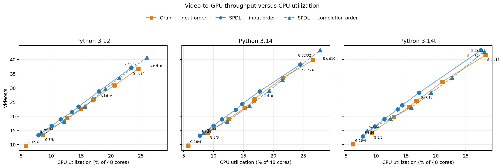
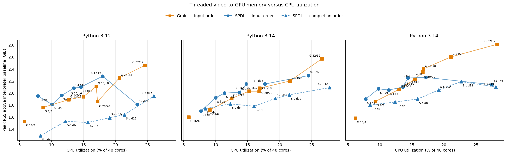

Migrating from Grain
====================

`Grain <https://github.com/google/grain>`_ and SPDL can both construct concurrent
input pipelines, but they expose different abstractions. Grain is dataset-first:
it preserves lazy random access through :py:class:`grain.MapDataset` and later
turns the dataset into an iterator. SPDL is stage-first: it connects a source,
independently scheduled operations, bounded queues, and a sink.

Migration is therefore a pipeline redesign, not an import replacement. SPDL is
a strong fit when the workload benefits from stage-specific concurrency or
async I/O. Its task and queue statistics provide the structured feedback needed
for manual tuning and agentic performance optimization. Features without a
built-in equivalent require an application-level adapter during migration.

Why SPDL uses a stage-first pipeline
------------------------------------

A production input pipeline often combines remote network reads, CPU decoding
or preprocessing, host-to-device transfer, accelerator computation, and
device-to-host transfer. These operations are limited by different resources,
so one concurrency setting is rarely appropriate for the entire pipeline.

For example, a remote read spends much of its lifetime waiting rather than
using a CPU and can often benefit from substantially more concurrency than a
CPU-bound transform. CPU work should keep the available cores busy, but
unbounded workers can delay the training loop through CPU contention and the
:doc:`noisy-neighbour effect <../optimization_guide/noisy_neighbour>`. Device
transfers have a different constraint again: accelerator copy engines commonly
allow one host-to-device and one device-to-host transfer to overlap with
computation, so transfer stages are usually kept at low concurrency and
scheduled independently in each direction.

SPDL represents these resource boundaries as pipeline stages. Each stage can
select its own execution model, concurrency, output ordering, and bounded queue,
which makes the scheduling policy correspond directly to the production data
path. A dataset abstraction is familiar and convenient for expressing samples
and transformations, but packaging heterogeneous work behind one dataset
iterator makes independent concurrency, buffering, and backpressure harder to
observe and tune.

This structure also makes the main performance knobs direct and local. For
example, ``pipe(fetch, concurrency=32)`` controls network concurrency while
``pipe(decode, concurrency=8)`` independently controls CPU decode concurrency;
the worker-pool size and sink buffer are separate settings. Grain exposes
effective iterator-level controls through ``ReadOptions`` and
``MultiprocessingOptions``, but those controls govern the worker layer around a
sequence of transforms rather than one named operation. The SPDL stage model
therefore makes it more intuitive to change one resource constraint at a time
and attribute the measured result to that change.

SPDL also records per-stage task time, throughput, queue wait time, and queue
occupancy. These measurements expose the current bottleneck and the effect of a
configuration change. Besides supporting manual tuning, the structured feedback
can drive an agentic optimization loop that measures the pipeline, changes one
stage's concurrency or buffering, and validates the end-to-end result. See the
:doc:`SPDL optimization guide <../optimization_guide/index>` and its
:doc:`performance-statistics reference <../optimization_guide/stats>`.

How Grain is commonly used
--------------------------

Grain has two APIs:

* :py:class:`grain.DataLoader` combines a random-access data source, sampler,
  flat operation list, worker pool, and output buffer.
* The Dataset API chains :py:class:`grain.MapDataset` and
  :py:class:`grain.IterDataset` transformations. It preserves random access as
  long as possible, then adds threaded reads, prefetching, or multiprocessing
  when converted to an iterable dataset.

In large training codebases, the Dataset API is the more common integration
shape. Representative pipelines use it to:

* wrap custom file, record, Hive, or in-memory random-access sources;
* seed, globally shuffle, repeat, and shard a dataset;
* map tokenization, decoding, augmentation, and collation functions;
* filter invalid examples and batch or pack variable-length examples;
* mix multiple datasets with weights;
* prefetch with :py:class:`grain.ReadOptions` and run transforms with
  :py:class:`grain.MultiprocessingOptions`; and
* save and restore :py:class:`grain.DatasetIterator` or elastic-iterator state
  with a training checkpoint.

Grain does have multithreading: ``ReadOptions(num_threads=N)`` concurrently
reads and applies ``MapDataset`` transformations with a
``concurrent.futures.ThreadPoolExecutor`` while returning elements in input
order. Without ``mp_prefetch``, that pool runs in the main process and no worker
process is created. When ``mp_prefetch`` wraps the iterator, ``ReadOptions``
instead configures each worker process. Grain's Dataset API does not expose an
equivalent completion-order switch.

Equivalent pipeline structure
-----------------------------

The following single-rank example applies the same source lookup, transform,
ordering, and fixed-size batching contract in each library. A typical Grain
pipeline separates the random-access graph from iteration:

.. code-block:: python

   import grain.python as grain

   dataset = (
       grain.MapDataset.source(source)
       .seed(seed)
       .shuffle()
       .map(transform)
       .to_iter_dataset(grain.ReadOptions(num_threads=8))
       .batch(batch_size, drop_remainder=True)
   )

   for batch in dataset:
       train_step(batch)

The corresponding SPDL pipeline makes the execution stages explicit:

.. code-block:: python

   from spdl.pipeline import PipelineBuilder
   from spdl.source import DistributedRandomSampler
   from spdl.source.utils import embed_shuffle

   sampler = embed_shuffle(
       DistributedRandomSampler(
           len(source), rank=0, world_size=1, seed=seed
       )
   )

   pipeline = (
       PipelineBuilder()
       .add_source(sampler)
       .pipe(source, concurrency=8, output_order="input")
       .pipe(transform, concurrency=4, output_order="input")
       .aggregate(batch_size, drop_last=True)
       .pipe(collate, concurrency=1)
       .add_sink(4)
       .build(num_threads=12)
   )

   for batch in pipeline:
       train_step(batch)

Both versions emit fixed-size batches without reordering after sampling. A
distributed migration must additionally match the application's exact sharding
and shuffle contract. The SPDL form makes lookup and transform scheduling
independent, so each stage can be tuned for its own resource constraint.
Collation is serial here because the example assumes it is inexpensive; give
it separate measured concurrency when it performs substantial CPU work.

Component mapping
-----------------

.. list-table:: Grain to SPDL mapping
   :header-rows: 1
   :widths: 28 30 42

   * - Grain
     - SPDL
     - Migration note
   * - ``RandomAccessDataSource``
     - An index iterable plus ``pipe(source)``
     - Yield records directly if random access is unnecessary. Yield indices and
       pass the random-access source to a pipe when lookup needs concurrency.
   * - ``IndexSampler`` or ``ShardOptions``
     - :py:class:`spdl.source.DistributedRandomSampler` or
       :py:class:`spdl.source.DistributedDeterministicSampler`
     - Match rank, world size, draw count, seed, and drop behavior before tuning.
   * - ``MapDataset`` or ``IterDataset``
     - :py:class:`spdl.pipeline.Pipeline`
     - SPDL is streaming and does not preserve a random-access dataset view.
   * - ``map`` or ``MapTransform``
     - :py:meth:`spdl.pipeline.PipelineBuilder.pipe`
     - Give I/O, decode, tokenization, collation, and transfer separate stages.
   * - ``random_map`` or ``RandomMapTransform``
     - A source or ``pipe`` stage that carries an explicit per-record RNG
     - Derive the RNG from the global seed, epoch, rank, and stable sample
       identity instead of sharing mutable global state.
   * - ``filter`` or ``FilterTransform``
     - A ``pipe`` operation that returns ``None`` for rejected items
     - Measure rejection rates; filtering changes downstream batch boundaries.
   * - ``flat_map``
     - A generator operation, or ``pipe`` followed by
       :py:meth:`spdl.pipeline.PipelineBuilder.disaggregate`
     - Preserve ordering explicitly if downstream logic depends on it.
   * - ``batch`` or ``Batch``
     - :py:meth:`spdl.pipeline.PipelineBuilder.aggregate`, followed by a collate
       ``pipe``
     - Match ``drop_remainder`` with ``drop_last``. Use a custom
       :py:class:`spdl.pipeline.defs.Aggregator` for size-aware packing.
   * - ``repeat``
     - ``add_source(..., continuous=True)`` or
       :py:func:`spdl.source.utils.repeat_source`
     - Decide where epoch boundaries and reshuffling occur.
   * - ``shuffle``
     - A random sampler, optionally wrapped by
       :py:func:`spdl.source.utils.embed_shuffle`
     - This covers index shuffling, not arbitrary streaming-buffer shuffle.
   * - ``ReadOptions`` and prefetch
     - Per-stage ``concurrency``, ``add_sink(buffer_size)``, and
       ``build(num_threads)``
     - SPDL makes scheduling and buffer choices explicit for each stage.
   * - ``MultiprocessingOptions``
     - ``ProcessPoolExecutor`` for one stage, an SPDL process execution region,
       or a subprocess pipeline
     - Put only GIL-holding work across a process boundary; serialization can
       erase the gain.
   * - ``MapDataset.mix``
     - Application composition of iterables or maps
     - :py:class:`spdl.source.utils.MergeIterator` is one weighted-iterable
       implementation. Match stopping, exhaustion, repetition, seeding, and
       checkpoint behavior.
   * - Dataset statistics and profiling
     - Pipeline task statistics, queue statistics, custom
       :py:class:`spdl.pipeline.TaskHook` objects, and
       :py:func:`spdl.pipeline.profile_pipeline`
     - Stage boundaries expose bottlenecks and backpressure. Task hooks can add
       per-sample pre/post-processing and measurements.

Migration work for non-equivalent features
------------------------------------------

As of SPDL 0.7.0, implement and validate the following behaviors in application
code. These sketches show the relevant builder fragment and omit the common
``add_sink(...).build(...)`` suffix, application-specific failure handling, and
checkpoint storage.

* **Checkpointable iterator state and elastic resume.** SPDL does not provide a
  general ``DatasetIterator.get_state``/``set_state`` equivalent. Persist the
  source epoch and committed source offset, then reconstruct the sampler on
  resume. Track consumed source positions directly because filtering can break
  the relationship between batch count and source position:

  .. code-block:: python

     from itertools import islice

     state = {"epoch": epoch, "source_offset": committed_source_offset}
     save_with_training_checkpoint(state)

     def make_sampler(epoch):
         return DistributedRandomSampler(
             len(source),
             rank=rank,
             world_size=world_size,
             seed=base_seed + epoch,
         )

     class ResumedEpoch:
         def __iter__(self):
             sampler = make_sampler(epoch=state["epoch"])
             return islice(iter(sampler), state["source_offset"], None)

     builder = PipelineBuilder().add_source(ResumedEpoch())

  Rebuild the source with offset zero when advancing to the next epoch. The
  epoch-to-seed mapping is part of the checkpoint contract and must be identical
  before and after resume.

* **Lazy random access after transformations.** A running SPDL pipeline is an
  iterator, not an indexable dataset. Keep a separate transformed view when
  indexed debugging or evaluation requires one:

  .. code-block:: python

     class TransformedView:
         def __len__(self):
             return len(source)

         def __getitem__(self, index):
             return transform(source[index])

     debug_view = TransformedView()
     builder = (
         PipelineBuilder()
         .add_source(range(len(debug_view)))
         .pipe(debug_view.__getitem__, concurrency=8, output_order="input")
     )

* **Random-access and checkpointable mixture state.** Compose application
  iterables or maps according to the required semantics. ``MergeIterator`` is
  one ready-made weighted iterable, but it does not preserve Grain
  ``MapDataset.mix`` random access or expose its RNG and parent iterator states:

  .. code-block:: python

     from itertools import chain
     from spdl.source.utils import MergeIterator

     class Concatenated:
         def __iter__(self):
             return chain(source_a, source_b)

     concatenated_builder = PipelineBuilder().add_source(Concatenated())

     weighted = MergeIterator(
         [source_a, source_b],
         weights=[0.8, 0.2],
         stop_after=epoch_size,
         seed=epoch_seed,
     )
     weighted_builder = PipelineBuilder().add_source(weighted)

* **Automatic per-record random keys.** Inject an RNG in the source or a pipe
  stage, derived from stable record metadata. A shared mutable global RNG is
  unsafe when a stage has concurrency greater than one:

  .. code-block:: python

     import hashlib
     import random

     def load_with_rng(index):
         identity = f"{global_seed}:{epoch}:{rank}:{index}".encode()
         seed = int.from_bytes(
             hashlib.blake2b(identity, digest_size=8).digest(), byteorder="big"
         )
         return source[index], random.Random(seed)

     def random_transform(item):
         sample, rng = item
         return augment(sample, rng)

     builder = (
         PipelineBuilder()
         .add_source(sampler)
         .pipe(load_with_rng, concurrency=16)
         .pipe(random_transform, concurrency=8)
     )

* **Drop-in elastic global batching.** Global batch size, worker topology,
  resharding, and resume behavior must be expressed by the application:

  .. code-block:: python

     if global_batch_size % world_size:
         raise ValueError("global batch size must be divisible by world size")
     rank_batch_size = global_batch_size // world_size
     sampler = DistributedRandomSampler(
         len(source),
         rank=rank,
         world_size=world_size,
         ddp_drop_last_distributed_round=True,
     )
     builder = (
         PipelineBuilder()
         .add_source(sampler)
         .pipe(source, concurrency=8)
         .aggregate(rank_batch_size, drop_last=True)
     )

  Keeping distributed-round dropping enabled gives every rank the same source
  length. ``drop_last=True`` then removes an incomplete per-rank batch, so all
  ranks emit the same number of batches. Change either policy only when the
  application explicitly synchronizes uneven ranks.

* **Dataset transformation introspection.** SPDL reports runtime stage behavior,
  and a custom ``TaskHook`` can capture per-sample inputs, timing, or failure
  metadata. It does not reproduce Grain's index-level dataset debugging model:

  .. code-block:: python

     from contextlib import asynccontextmanager
     from time import perf_counter

     from spdl.pipeline import TaskHook, TaskStatsHook

     class SampleTiming(TaskHook):
         @asynccontextmanager
         async def task_hook(self, input_item=None):
             started = perf_counter()
             try:
                 yield
             finally:
                 record_latency(input_item, perf_counter() - started)

     def hook_factory(stage):
         hooks = [TaskStatsHook(stage)]
         if stage.stage_name == "decode":
             hooks.append(SampleTiming())
         return hooks

     pipeline = (
         PipelineBuilder()
         .add_source(source)
         .pipe(decode, concurrency=8, name="decode")
         .add_sink(4)
         .build(
             num_threads=24,
             task_hook_factory=hook_factory,
         )
     )

Packing is not a fundamental gap: implement token- or byte-budget packing with
a custom :py:class:`spdl.pipeline.defs.Aggregator`. Multiprocessing is also not a
gap, but SPDL asks you to choose the process boundary instead of applying one
worker setting to the whole dataset.

Migration workflow
------------------

1. **Write down the semantic contract.** Record the exact sample order, epoch
   length, sharding, shuffle seed, filtering, batch/drop behavior, random
   augmentation, mixture weights, and checkpoint/resume guarantees.
2. **Create a parity test.** Compare stable sample identifiers and batch shapes
   over multiple epochs and ranks. Test restart from a mid-epoch checkpoint if
   the Grain pipeline supports it.
3. **Move sampling into the source.** Start with the matching SPDL distributed
   sampler. Feed its indices to ``pipe(source)`` for automatic ``__getitem__``
   lookup, or make the source yield records directly.
4. **Split work by resource.** Use separate stages for remote read, decode,
   tokenization or augmentation, collation, and device transfer. This is the
   change that enables SPDL's stage-level optimization.
5. **Choose execution per stage.** Prefer async functions for async I/O and
   threads for native operators that release the GIL. For measured GIL-holding
   work, use ``pipe(..., executor=ProcessPoolExecutor(...),
   output_order="input")`` when order is required. A multi-stage
   ``to(ProcessPoolExecutorConfig(...))`` region instead emits in completion
   order, requires application-level reordering, and must be closed with
   ``to(MAIN_PROCESS)`` before adding the sink.
6. **Batch late enough to expose parallelism.** Aggregate records, then collate
   once. For variable-length data, use a custom aggregator and test its final
   flush and ``drop_last`` behavior.
7. **Bound every queue.** Start with small sink and inter-stage buffers. Large
   prefetch values can hide a bottleneck while increasing host memory and
   checkpoint replay distance.
8. **Tune from measurements.** Inspect queue occupancy and per-stage task time,
   then change one stage's concurrency at a time. Optimize end-to-end training
   step time, not loader microbenchmark throughput alone.
9. **Roll out with measured gates.** Compare output fingerprints, recovery
   behavior, and training metrics while moving traffic to the SPDL path.

Benchmark the replacement
-------------------------

We benchmarked an end-to-end video-loading task that reads encoded videos from
remote storage, demuxes and decodes two-second clips on CPU, collates batches,
and copies tensors to a GPU on a dedicated CUDA stream. The task was implemented
with Grain and SPDL and run with threading and multiprocessing configurations
across Python 3.12, 3.14, and free-threaded 3.14. The following plot shows the
relationship between CPU utilization and video throughput.

The libraries expose different scaling controls. Grain configures worker threads
and prefetch for the composed dataset, while SPDL configures concurrency for
individual pipeline stages. Worker counts are therefore not directly
comparable, so the plots use measured CPU utilization as the common resource
axis. Grain preserves input order. SPDL threading was measured with both input
and completion order; process-region measurements remain in the table for
reference.

   CPU utilization versus video throughput. Squares are Grain with input order,
   circles are SPDL with input order, and dashed triangles are SPDL with
   completion order. Process measurements remain in the table below.

The two solid input-order series are the direct migration comparison. At
roughly matched CPU utilization, Grain with 16 threads and prefetch 16 processed
22.7 videos/s using 7.21 CPU cores on Python 3.12, while SPDL with twelve decode
workers processed 23.4 videos/s using 6.99 cores. The corresponding results were
22.9 videos/s at 7.29 cores for Grain versus 24.4 at 7.10 for SPDL on Python
3.14, and 23.2 at 7.42 versus 23.9 at 6.92 on Python 3.14t. Across the sweep,
SPDL generally delivered more throughput for the same measured CPU budget. In
this workload, the result indicates that SPDL's stage-wise orchestration uses
CPU more efficiently. As the memory plot below shows, that gain came with a
small host-memory premium: 0.02--0.16 GiB at the matched points.

Input order holds a completed item until every preceding item is ready.
Completion order emits each item as soon as it finishes, avoiding that
head-of-line wait but changing observable ordering. At the same 16-worker decode
setting, completion order reached 40.7--43.3 videos/s using 12.47--13.49 cores,
compared with 28.3--28.8 videos/s using 8.28--8.65 cores for input order. The
completion-order series demonstrates the additional throughput available when
the application does not require Grain-equivalent ordering; it is not the
apples-to-apples migration result.

The SPDL sweep illustrates stage-local tuning: after identifying decode as the
CPU-bound stage, only decode concurrency changes. Increasing decode concurrency
to 24 reached 37.1 videos/s using 11.24 CPU cores on Python 3.12 and 38.3 using
11.77 cores on Python 3.14. Python 3.14t reached 43.3 videos/s using 13.21 cores
with 32 workers. These results demonstrate the tuning mechanism for this
workload rather than a universal concurrency setting.

Benchmark setup
~~~~~~~~~~~~~~~

The measured workload reads 128 videos in four-record bulks, decodes eight
224-by-224 RGB frames per video, batches eight videos, discards one warmup, and
performs three measured runs. The reported Grain results use Grain 0.2.16.
That release does not provide free-threaded ``cp314t`` builds of its native
ArrayRecord and index-shuffle modules. The 3.14t experiment packages Grain's
Python sources and replaces imports of those two unused modules with stubs; the
measured pipeline does not call either feature.

Stripped of storage-specific types and names, the Grain implementation has this
shape. ``BulkVideoSource`` performs the remote read, and ``ExpandBulk`` turns
each returned bulk into individual encoded-video records:

.. code-block:: python

   grain_dataset = (
       grain.MapDataset.source(BulkVideoSource(...))
       .apply(ExpandBulk(max_fan_out=bulk_size))
       .map(demux_video)
       .map(decode_video)
       .to_iter_dataset(
           grain.ReadOptions(
               num_threads=grain_workers,
               prefetch_buffer_size=grain_prefetch,
           )
       )
       .batch(batch_size, drop_remainder=False)
   )

   for batch in grain_dataset:
       consume(transfer_to_gpu(collate(batch)))

The equivalent SPDL implementation exposes each operation as a separately
tunable stage. ``gpu_transfer_executor`` is a dedicated one-thread executor so
the copy uses its own CUDA stream:

.. code-block:: python

   pipeline = (
       PipelineBuilder()
       .add_source(range(len(bulk_video_source)))
       .pipe(
           bulk_video_source,
           concurrency=fetch_workers,
           output_order=output_order,
       )
       .disaggregate()
       .pipe(demux_video, concurrency=demux_workers, output_order=output_order)
       .pipe(decode_video, concurrency=decode_workers, output_order=output_order)
       .aggregate(batch_size, drop_last=False)
       .pipe(collate)
       .pipe(
           transfer_to_gpu,
           concurrency=1,
           executor=gpu_transfer_executor,
       )
       .add_sink(prefetch)
       .build(num_threads=spdl_threads)
   )

   for batch in pipeline:
       consume(batch)

The baseline Grain threading configuration sets
``ReadOptions(num_threads=16, prefetch_buffer_size=4)``. Its multiprocessing
configuration disables those two controls and instead sets
``MultiprocessingOptions(num_workers=8, per_worker_buffer_size=4)``. The SPDL
threading configuration sets fetch, demux, decode, and H2D concurrency to four,
three, eight, and one respectively, uses a 40-thread shared pool, and holds four
batches at the sink. Its process configuration puts fetch through decode in an
eight-worker process region while keeping H2D transfer in the main process.
That region sends decoded frame arrays back to the main process for collation;
the resulting inter-process communication makes this pipeline unsuited to
multiprocessing.

CPU usage and throughput cover the same end-to-end interval, including pipeline
setup and shutdown, aggregated over the measured runs. The RSS baseline is
captured in the spawned benchmark interpreter after module imports and before
pipeline construction or warmup. Peak RSS is the sampled aggregate process-tree
resident memory during warmup and measured runs; the reported delta subtracts
that baseline. Process-mode deltas therefore include the additional worker
interpreters. The benchmark host exposed 48 CPU cores and about 1.5 TiB of host
memory.

These configurations are starting points for the two libraries, not a claim
that their worker counts or CPU consumption are equivalent. In particular,
Grain's ``prefetch_buffer_size`` limits how many read threads can make progress.
Raising ``num_threads`` while leaving the prefetch depth at four did not raise
CPU utilization in this workload, so the Grain sweep changes both
``num_threads`` and ``prefetch_buffer_size`` together.

A preliminary Python 3.14 fetch-stage sweep found that raising SPDL fetch
concurrency from four to 32 left throughput at 23.3 videos/s while increasing
incremental peak RSS from 1.34 to 1.80 GiB; one fetch worker reduced throughput
to 18.0 videos/s. The main matrix therefore uses four fetch workers. The SPDL
decode sweep keeps fetch, demux, H2D transfer, pool size, and sink size fixed and
changes only the decode stage's ``concurrency``. This illustrates how the stage
model exposes a direct tuning knob once a bottleneck is identified.

.. list-table:: Video-to-GPU results
   :header-rows: 1

   * - Python
     - Library
     - Execution
     - Order
     - Concurrency
     - Videos/s
     - CPU cores (host %)
     - RSS baseline → peak; Δ GiB (host %)
     - CUDA MiB
   * - 3.12
     - Grain
     - Threads
     - Input
     - threads=16; prefetch=4
     - 9.6
     - 2.79 (5.8%)
     - 1.40 → 2.93; Δ 1.53 (0.10%)
     - 40
   * - 3.12
     - Grain
     - Processes
     - Input
     - processes=8; read threads=0; buffer/worker=4
     - 5.2
     - 7.22 (15.0%)
     - 1.41 → 22.80; Δ 21.39 (1.42%)
     - 40
   * - 3.12
     - SPDL
     - Threads
     - Input
     - fetch/demux/decode/H2D=4/3/8/1; pool=40; sink=4
     - 18.9
     - 5.61 (11.7%)
     - 1.41 → 3.35; Δ 1.95 (0.13%)
     - 160
   * - 3.12
     - SPDL
     - Threads
     - Completion
     - fetch/demux/decode/H2D=4/3/8/1; pool=40; sink=4
     - 23.4
     - 7.66 (16.0%)
     - 1.40 → 3.36; Δ 1.95 (0.13%)
     - 160
   * - 3.12
     - SPDL
     - Processes
     - Completion
     - region=8; H2D=1; main pool=2; sink=4
     - 5.7
     - 7.75 (16.2%)
     - 1.41 → 23.20; Δ 21.79 (1.44%)
     - 160
   * - 3.14
     - Grain
     - Threads
     - Input
     - threads=16; prefetch=4
     - 9.7
     - 2.78 (5.8%)
     - 1.46 → 3.05; Δ 1.60 (0.11%)
     - 40
   * - 3.14
     - Grain
     - Processes
     - Input
     - processes=8; read threads=0; buffer/worker=4
     - 5.3
     - 7.21 (15.0%)
     - 1.46 → 23.39; Δ 21.93 (1.45%)
     - 40
   * - 3.14
     - SPDL
     - Threads
     - Input
     - fetch/demux/decode/H2D=4/3/8/1; pool=40; sink=4
     - 19.5
     - 5.57 (11.6%)
     - 1.46 → 3.39; Δ 1.93 (0.13%)
     - 160
   * - 3.14
     - SPDL
     - Threads
     - Completion
     - fetch/demux/decode/H2D=4/3/8/1; pool=40; sink=4
     - 23.8
     - 7.65 (15.9%)
     - 1.46 → 3.27; Δ 1.81 (0.12%)
     - 160
   * - 3.14
     - SPDL
     - Processes
     - Completion
     - region=8; H2D=1; main pool=2; sink=4
     - 5.8
     - 7.67 (16.0%)
     - 1.46 → 23.51; Δ 22.06 (1.46%)
     - 160
   * - 3.14t
     - Grain
     - Threads
     - Input
     - threads=16; prefetch=4
     - 10.1
     - 2.97 (6.2%)
     - 1.55 → 3.13; Δ 1.58 (0.10%)
     - 40
   * - 3.14t
     - Grain
     - Processes
     - Input
     - processes=8; read threads=0; buffer/worker=4
     - 14.8
     - 4.83 (10.1%)
     - 1.55 → 3.35; Δ 1.80 (0.12%)
     - 40
   * - 3.14t
     - SPDL
     - Threads
     - Input
     - fetch/demux/decode/H2D=4/3/8/1; pool=40; sink=4
     - 18.2
     - 5.42 (11.3%)
     - 1.55 → 3.45; Δ 1.89 (0.13%)
     - 160
   * - 3.14t
     - SPDL
     - Threads
     - Completion
     - fetch/demux/decode/H2D=4/3/8/1; pool=40; sink=4
     - 23.6
     - 7.61 (15.8%)
     - 1.55 → 3.51; Δ 1.96 (0.13%)
     - 160
   * - 3.14t
     - SPDL
     - Processes
     - Completion
     - region=8; H2D=1; main pool=2; sink=4
     - 5.8
     - 7.73 (16.1%)
     - 1.56 → 24.91; Δ 23.35 (1.55%)
     - 160

The Grain thread sweep produced the following results. The 16-thread rows are
different from the first table because this sweep raises prefetch from four to
16, allowing all configured threads to make progress.

.. list-table:: Grain thread and prefetch sweep
   :header-rows: 1

   * - Python
     - Threads
     - Prefetch
     - Videos/s
     - CPU cores (host %)
     - RSS baseline → peak; Δ GiB (host %)
     - CUDA MiB
   * - 3.12
     - 8
     - 8
     - 13.4
     - 4.19 (8.7%)
     - 1.40 → 3.16; Δ 1.76 (0.12%)
     - 40
   * - 3.12
     - 12
     - 12
     - 19.3
     - 6.11 (12.7%)
     - 1.41 → 3.30; Δ 1.89 (0.13%)
     - 40
   * - 3.12
     - 16
     - 16
     - 22.7
     - 7.21 (15.0%)
     - 1.42 → 3.35; Δ 1.94 (0.13%)
     - 40
   * - 3.12
     - 18
     - 18
     - 25.7
     - 8.18 (17.0%)
     - 1.40 → 3.52; Δ 2.11 (0.14%)
     - 40
   * - 3.12
     - 20
     - 20
     - 26.1
     - 8.26 (17.2%)
     - 1.41 → 3.27; Δ 1.86 (0.12%)
     - 40
   * - 3.12
     - 24
     - 24
     - 30.9
     - 9.87 (20.6%)
     - 1.40 → 3.65; Δ 2.25 (0.15%)
     - 40
   * - 3.12
     - 32
     - 32
     - 36.8
     - 11.83 (24.6%)
     - 1.41 → 3.86; Δ 2.46 (0.16%)
     - 40
   * - 3.14
     - 8
     - 8
     - 14.2
     - 4.37 (9.1%)
     - 1.46 → 3.18; Δ 1.72 (0.11%)
     - 40
   * - 3.14
     - 12
     - 12
     - 19.1
     - 6.00 (12.5%)
     - 1.47 → 3.38; Δ 1.91 (0.13%)
     - 40
   * - 3.14
     - 16
     - 16
     - 22.9
     - 7.29 (15.2%)
     - 1.45 → 3.48; Δ 2.03 (0.13%)
     - 40
   * - 3.14
     - 18
     - 18
     - 25.6
     - 8.09 (16.8%)
     - 1.46 → 3.49; Δ 2.03 (0.13%)
     - 40
   * - 3.14
     - 20
     - 20
     - 26.2
     - 8.13 (16.9%)
     - 1.47 → 3.55; Δ 2.08 (0.14%)
     - 40
   * - 3.14
     - 24
     - 24
     - 33.6
     - 10.36 (21.6%)
     - 1.46 → 3.66; Δ 2.20 (0.15%)
     - 40
   * - 3.14
     - 32
     - 32
     - 39.8
     - 12.76 (26.6%)
     - 1.46 → 4.03; Δ 2.57 (0.17%)
     - 40
   * - 3.14t
     - 8
     - 8
     - 14.2
     - 4.47 (9.3%)
     - 1.55 → 3.42; Δ 1.86 (0.12%)
     - 40
   * - 3.14t
     - 12
     - 12
     - 19.7
     - 6.23 (13.0%)
     - 1.55 → 3.61; Δ 2.06 (0.14%)
     - 40
   * - 3.14t
     - 16
     - 16
     - 23.2
     - 7.42 (15.5%)
     - 1.55 → 3.78; Δ 2.23 (0.15%)
     - 40
   * - 3.14t
     - 18
     - 18
     - 25.4
     - 8.06 (16.8%)
     - 1.56 → 3.96; Δ 2.40 (0.16%)
     - 40
   * - 3.14t
     - 20
     - 20
     - 25.5
     - 8.02 (16.7%)
     - 1.55 → 3.90; Δ 2.35 (0.16%)
     - 40
   * - 3.14t
     - 24
     - 24
     - 32.2
     - 10.14 (21.1%)
     - 1.56 → 4.16; Δ 2.60 (0.17%)
     - 40
   * - 3.14t
     - 32
     - 32
     - 41.6
     - 13.60 (28.3%)
     - 1.56 → 4.37; Δ 2.81 (0.19%)
     - 40

The SPDL sweep changes only decode-stage concurrency. Fetch remains at four,
demux at three, H2D transfer at one, the shared pool at 40 threads, and the sink
at four batches. The eight-worker entry is a new isolated repeat of the same
configuration in the original matrix, so normal run-to-run variation is
visible.

.. list-table:: SPDL input-order decode-stage concurrency sweep
   :header-rows: 1

   * - Python
     - Decode workers
     - Videos/s
     - CPU cores (host %)
     - RSS baseline → peak; Δ GiB (host %)
     - CUDA MiB
   * - 3.12
     - 4
     - 13.3
     - 3.78 (7.9%)
     - 1.40 → 3.36; Δ 1.95 (0.13%)
     - 160
   * - 3.12
     - 6
     - 16.6
     - 4.86 (10.1%)
     - 1.41 → 3.22; Δ 1.81 (0.12%)
     - 160
   * - 3.12
     - 8
     - 18.9
     - 5.58 (11.6%)
     - 1.41 → 3.37; Δ 1.96 (0.13%)
     - 160
   * - 3.12
     - 10
     - 21.5
     - 6.50 (13.5%)
     - 1.41 → 3.49; Δ 2.08 (0.14%)
     - 160
   * - 3.12
     - 12
     - 23.4
     - 6.99 (14.6%)
     - 1.41 → 3.51; Δ 2.10 (0.14%)
     - 160
   * - 3.12
     - 16
     - 28.8
     - 8.65 (18.0%)
     - 1.41 → 3.69; Δ 2.28 (0.15%)
     - 160
   * - 3.12
     - 24
     - 37.1
     - 11.24 (23.4%)
     - 1.41 → 3.22; Δ 1.81 (0.12%)
     - 160
   * - 3.14
     - 4
     - 13.2
     - 3.68 (7.7%)
     - 1.46 → 3.16; Δ 1.70 (0.11%)
     - 160
   * - 3.14
     - 6
     - 16.7
     - 4.79 (10.0%)
     - 1.46 → 3.38; Δ 1.92 (0.13%)
     - 160
   * - 3.14
     - 8
     - 18.9
     - 5.47 (11.4%)
     - 1.47 → 3.47; Δ 2.00 (0.13%)
     - 160
   * - 3.14
     - 10
     - 22.3
     - 6.55 (13.7%)
     - 1.47 → 3.48; Δ 2.01 (0.13%)
     - 160
   * - 3.14
     - 12
     - 24.4
     - 7.10 (14.8%)
     - 1.46 → 3.61; Δ 2.15 (0.14%)
     - 160
   * - 3.14
     - 16
     - 28.8
     - 8.49 (17.7%)
     - 1.46 → 3.60; Δ 2.15 (0.14%)
     - 160
   * - 3.14
     - 24
     - 38.3
     - 11.77 (24.5%)
     - 1.46 → 3.75; Δ 2.29 (0.15%)
     - 160
   * - 3.14t
     - 4
     - 12.9
     - 3.72 (7.8%)
     - 1.56 → 3.46; Δ 1.90 (0.13%)
     - 160
   * - 3.14t
     - 6
     - 16.4
     - 4.72 (9.8%)
     - 1.55 → 3.63; Δ 2.07 (0.14%)
     - 160
   * - 3.14t
     - 8
     - 19.0
     - 5.48 (11.4%)
     - 1.55 → 3.61; Δ 2.05 (0.14%)
     - 160
   * - 3.14t
     - 10
     - 22.4
     - 6.53 (13.6%)
     - 1.56 → 3.65; Δ 2.10 (0.14%)
     - 160
   * - 3.14t
     - 12
     - 23.9
     - 6.92 (14.4%)
     - 1.55 → 3.80; Δ 2.25 (0.15%)
     - 160
   * - 3.14t
     - 16
     - 28.3
     - 8.28 (17.2%)
     - 1.55 → 3.82; Δ 2.26 (0.15%)
     - 160
   * - 3.14t
     - 32
     - 43.3
     - 13.21 (27.5%)
     - 1.55 → 3.70; Δ 2.14 (0.14%)
     - 160

   Peak aggregate process-tree RSS above each interpreter's post-import
   baseline for threaded configurations. Process configurations remain in the
   results table because their different memory scale obscures the threaded
   comparison. Point labels show the configured Grain threads/prefetch or SPDL
   decode concurrency; ``S-i`` and ``S-c`` denote SPDL input and completion
   order. The horizontal axis shows measured CPU utilization.

The post-import interpreter baseline was 1.40--1.56 GiB. Thread configurations
added 1.29--2.81 GiB above that baseline. At the near-matched 16-thread Grain
and twelve-worker SPDL input-order points, SPDL used 0.02--0.16 GiB more
incremental host memory. Input ordering can retain completed intermediate items
while waiting for earlier records; at twelve workers, allowing completion order
reduced SPDL's incremental RSS by 0.06--0.46 GiB. The input-order comparison
therefore shows a modest memory cost alongside SPDL's higher throughput at a
similar CPU budget.

Process cases other than patched Grain on Python 3.14t added 21.39--23.35 GiB
because their worker interpreters are included; patched Grain on Python 3.14t
added 1.80 GiB. SPDL reserved more CUDA cache memory than Grain in these runs.
Choose a configuration using end-to-end training throughput, ordering
requirements, and resource limits rather than loader throughput alone. Results
can vary with storage locality and host load; rerun this harness for the target
dataset and placement.

.. seealso::

   :doc:`../optimization_guide/index`
      Measure stage statistics and tune concurrency.

   :doc:`../getting_started/execution_models`
      Choose threading, multiprocessing, or hybrid execution.

   :doc:`PyTorch migration guide <../migration/pytorch>`
      See another dataset-first loader translated into SPDL stages.
