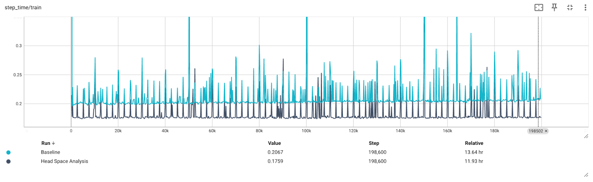

Headspace Analysis
==================

The first step when optimizing the data loading is to determine if the data loading is
really a performance bottleneck and how much potential improvement we can achieve.

Estimating the maximum gain with caching
----------------------------------------

:py:class:`spdl.dataloader.CacheDataLoader` (and its underlying implementation
:py:func:`spdl.pipeline.cache_iterator`) is a utility that allows you to measure the
possible improvement with minimum change. As the name suggests, it caches some batches
then returns them.

.. note::

   The :py:class:`~spdl.dataloader.CacheDataLoader` is only intended for the
   headspace analysis. It is not for replacing the actual data loader.
   By using a small number of caches, the model no longer achieves the accuracy of
   the original training, but the performance (speed) of training loop is
   still applicable, and this helps deciding how to optimize the training pipeline.

The usage is simple. Just wrap the existing data loader (can be any iterable.
Does not have to be SPDL), and run the training in the same way.
The following snippet illustrates this.

.. code-block:: diff

   +from spdl.dataloader import CacheDataLoader
   +
   dataloader = DataLoader(...)
   +dataloader = CacheDataLoader(
   +    dataloader,
   +    num_caches=10,
   +    return_caches_after=100,
   +)

The following figure illustrates the how the performance can change when caching the data.

The ``step_time`` is the time the training loop takes to complete one iteration of training,
that is, model forward, loss computation, model backward, and parameter update.

The pipeline takes about 200 ms for one step. The analysis suggests that if we manage to
optimize the data loader to its extreme, it can give 30ms improvement, which is 15%
reduction in training time.

Deciding what to work on
------------------------

So now we need to think and decide. Is it worth spending time to improve the data loading?
The answer depends on variety of cost factors. How often is this pipeline used? What's the
prospect for successful optimization?

As we will see later in detail, optimizing distributed system is not an easy task.
We try to make it easier with SPDL, but there are cases where we were not able to improve
before we ran out of ideas and approaches.

Another good question to ask is when we stop trying to optimize data loading and try
something different, like optimizing the model. If the data loading is optimized to
certain degree, optimizing the model becomes more effective.
There are many techniques you can apply.
`Torch compile <https://pytorch.org/tutorials/intermediate/torch_compile_tutorial.html>`_
and `CUDA Graph <https://pytorch.org/docs/stable/torch.compiler_cudagraph_trees.html>`_
help reduce the CUDA kernel launch overhead.
Once you optimize the model, then the data loading might become the bottleneck, then
you can spend more resource to optimize it.
