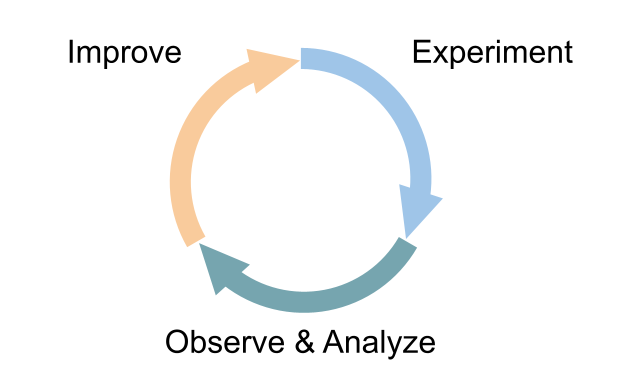
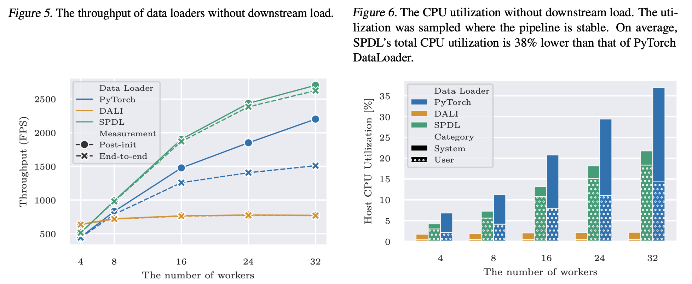
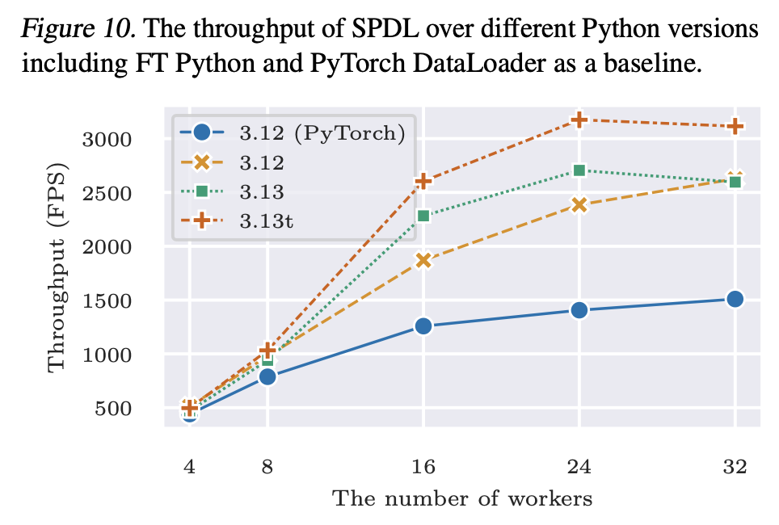

Overview
========

What is SPDL?
-------------

SPDL (Scalable and Performant Data Loading) is a library for building
efficient data preprocessing pipeline, primarily aimed at ML/AI applications.
It was created by a group of engineers/researchers who works on
improving the efficiency of GPU workloads at Meta.

Core Concept
~~~~~~~~~~~~

Its design incorporates the authors' experience on optimizing AI training
pipelines and the UX/DevX feedbacks from pipeline owners.
The key features include

- The pipeline construction is intuitive.
- The pipeline execution is fast and efficient.
- The pipeline abstraction is flexible so that users can choose structures
  fit their environment/data/requirements.
- The pipeline can export the runtime statistics of subcomponents, which
  helps identify the bottleneck.

These features allow to create a feedback loop, with which users can
iteratively improve the performance of the pipeline.

Performance & Efficiency
~~~~~~~~~~~~~~~~~~~~~~~~

Data loading is an important component in AI training. It must be fast
but also efficient because
`high CPU utilization can degrade the training performance <./optimization_guide/noisy_neighbour.html>`_.

The following plots are from benchmarks we conducted as part of our
study†.

The figure 5 and 6 show that SPDL if faster than other data loading
solutions, while utilizing CPU more efficiently.

The pipeline abstraction by default uses multi-threading as the core
parallelism.
The performance of the pipeline is improved with the recent Python
version upgrade, and enabling free-threading makes it even faster.
Aoption of SPDL also paves the way for adoption of free-threaded
Python in ML/AI application.

.. raw:: html

   <ul style="list-style-type: '† ';">
   <li><a href="https://arxiv.org/abs/2504.20067">https://arxiv.org/abs/2504.20067</a></li>
   </ul>

Media I/O
~~~~~~~~~

Oftentimes, the bottleneck of data loading is in media decoding and pre-processing.
So, in addition to the pipeline abstraction, SPDL also provides an I/O module for
multimedia (audio, video and image) processing.
This I/O module was designed from scratch to achieve high performance and high throughput.

What SPDL is NOT
----------------

* SPDL is not a drop-in replacement of existing data loading solutions.
* SPDL does not guarantee automagical performance improvement.

SPDL was started as an experiment to achieve high throughput with
thread-based parallelism even under the constraint of GIL.

SPDL is not expected to be the fastest solution out-of-box.
It gives flexibility and observability which allow users to iteratively
optimize the data loading pipeline.

How to use SPDL?
----------------

SPDL is highly flexible. You can use it in variety of ways.

1. As a new end-to-end data loading pipeline.
   The primal goal of SPDL is to build performant data loading solutions for ML.
   The project mostly talk about the performance in end-to-end (from data storage
   to GPUs) context.
   Using SPDL as a replacement for existing data loading solution is what the
   development team intends.
2. As a replacement for media processor.
   SPDL uses multi-threading for fast data processing. It is possible to use it in
   sub-processes. If your current data loading pipeline is elaborated, and it is not
   ideal to replace the whole data loading pipeline, you can start adopting SPDL
   by replacing the media processing part. This should allow reducing the number of
   sub-processes, improving the overall performance.
3. As a research tool in free-threaded Python and high-performance computing.
   SPDL's task execute engine uses async event loop at its core. Async event loop
   itself is single-threaded. Only the functions passed to the executors are
   executed concurrently. This makes SPDL an ideal test bed for experimenting with
   free-threaded Python and high-performance computing.
