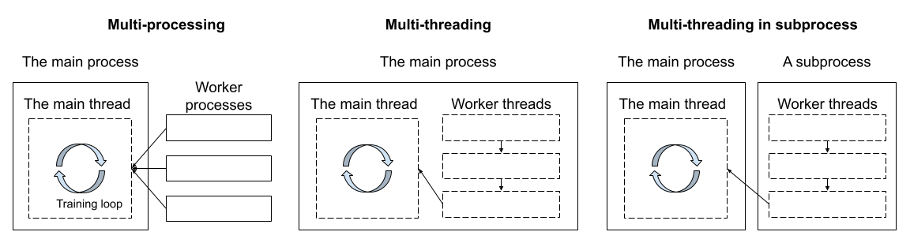

Parallelism and Performance
===========================

With the introduction of free-threaded Python, the use of multi-threading
will become undoubtedly common.

When we started SPDL, we thought multi-threading would solve all the data
loading inefficiency. However, we encountered a case where simply applying
multi-threading (while properly releasing the GIL) degradated the performance.
We would like to share our experience and thoughts for parallelism and
performance.

Pipeline Speed
--------------

The following plot shows the training QPS (inverse of step time) of the pipeline.

- ``baseline`` is the original implementation, which is based on TorchData's
  ``StatefulDataLaoder``.
- ``headspace`` is the upper limit obtained by using :py:class:`~spdl.dataloader.CacheDataLoader`.
  (See `Headspace Analysis <./headspace_analysis.html>`_.)
- ``mt`` is the solution based on simple multi-threading.
- ``mtp`` is the optimized solution, where the pipeline (multi-threaded) is executed in subprocess.

.. raw:: html

   

The baseline can process around 2.4 batches per second.
The headspace analysis suggests the maximum performance we can get is around 4.2.

This suggests that there is enough space for data loading improvement,
so we tried SPDL with multithreading.
To our surprise, the speed dropped to 1.2 batches per second.

Inconsistent Performance
------------------------

What confused us was that the other performance metrics from model part were
not consistent with the overall performance drop.
The following plots are the average time for backward path and optimizer step.

.. raw:: html

   

.. raw:: html

   

We did not make any change to model architecture or loss, when we swapped
the data loader.
The backward path and the optimizer step appear to be faster than the
baseline.
However, since ``mt`` run is overall slower, this suggests that other model
computation part is slower for ``mt`` run.
(We do not have breakdown for forward path.)
We can also see that the ``mt`` run shows spiky behavior than the others.

Noisy Neighbour and multiprocessing
-----------------------------------

After many failed attempt of resolving this, we suspected this could be
due to `the Noisy Neighbour <./noisy_neighbour.html>`_, even though the
CPU utilization of ``mt`` run is a little above 20%, whereas the baseline
run uses more than 60%. (PyTorch DataLoader uses multiprocessing
in very inefficient manner.)

The core issue of the noisy neighbour is that CPU cannot launch the GPU
kernel at timely manner. The CPU task scheduling is handled by the OS,
and there is a great deal in this topic, but what we can do with a little
bit of effort was to move the pipeline parallelism out of the main process
and execute it in a dedicated subprocess.

The following figure illustrates this.

It turned out that this multi-threading in subprocess (``mtp``) is
highly effective. It consumed a little bit more CPU resource (~26%)
than simple ``mt`` (~20%), but it wass faster, and no spiky behaviour
was observed.

.. include:: ../plots/parallelism.txt

How to run move the Pipeline in subprocess
------------------------------------------

Through this work, we added
:py:func:`spdl.pipeline.iterate_in_subprocess` and its wrapper
:py:func:`spdl.pipeline.run_pipeline_in_subprocess`.

Using these functions you can execute iterables and
:py:class:`~spdl.pipeline.Pipeline` s in subprocess.

.. admonition:: Example

   .. code-block:: python

      # Construct a builder
      builder = (
          spdl.pipeline.PipelineBuilder()
          .add_source(...)
          .pipe(...)
          ...
          .add_sink(...)
      )

      # Move it to the subprocess, build the Pipeline
      iterator = run_pipeline_in_subprocess(builder)

      # Iterate
      for item in iterator:
          ...
