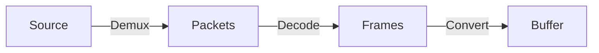

# Low-level I/O APIs

The low-level I/O APIs are components to build complex/concurrent decoding sequences.

There are three steps to decode source data into buffer (contiguous memory).



The following functions implement each stage

*Demuxing*

- Single sequence [async_demux_media][spdl.io.async_demux_media] ([demux_media][spdl.io.demux_media])
- Multiple sequences [async_streaming_demux][spdl.io.async_streaming_demux] ([streaming_demux][spdl.io.streaming_demux])

*Decoding*

- CPU decoding [async_decode_packets][spdl.io.async_decode_packets] ([decode_packets][spdl.io.decode_packets])
- NVDEC decoding [async_decode_packets_nvdec][spdl.io.async_decode_packets_nvdec] ([decode_packets_nvdec][spdl.io.decode_packets_nvdec])

*Frame conversion*

- [async_convert_frames][spdl.io.async_convert_frames] ([convert_frames][spdl.io.convert_frames])

!!! note

    When low-level I/O functions are called, tasks are immediately queued to the task queue of
    the thread pool executor.
    The executor might start processing them before Python code `await`s the corresponding
    coroutines.

??? note "Example: Convert audio frames to a contiguous buffer, then cast it to NumPy array."

    ```python
    >>> import asyncio
    >>> import spdl.io

    >>> async def _load_audio(src):
    ...     packets = await spdl.io.async_demux_media("audio", src)
    ...     frames = await spdl.io.async_decode_packets(packets)
    ...     buffer = await spdl.io.async_convert_frames(frames)
    ...     array = spdl.io.to_numpy(buffer)
    ...     return array
    >>> array = asyncio.run(_load_audio("sample.wav"))
    >>>
    ```

??? note "Example: Convert video frames to a contiguous buffer, transfer it to a CUDA device, then cast the resulting buffer to Numba CUDA tensor."

    ```python
    >>> async def _load_video_to_numba(src):
    ...     packets = await spdl.io.async_demux_media("video", src)
    ...     frames = await spdl.io.async_decode_packets(packets)
    ...     buffer = await spdl.io.async_convert_frames(frames, cuda_device_index=0)
    ...     tensor = spdl.io.to_numba(buffer)
    ...     return tensor
    >>> tensor = asyncio.run(_load_video_to_numba("sample.mp4"))
    >>>
    ```

??? note "Example: Convert batch image frames to a contiguous buffer, transfer it to a CUDA device using PyTorch's CUDA caching allocator, then cast the resulting buffer to PyTorch tensor."

    ```python
    >>> import asyncio
    >>> import spdl.io
    >>> import torch
    >>>
    >>> async def _load_image(src):
    ...     packets = await spdl.io.async_demux_media("image", src)
    ...     return await spdl.io.async_decode_packets(packets)
    >>>
    >>> async def _batch_load_image(srcs):
    ...     tasks = [asyncio.create_task(_load_image(src)) for src in srcs]
    ...     frames = await asyncio.gather(*tasks)
    ...
    ...     buffer = await spdl.io.async_convert_frames(
    ...         frames,
    ...         cuda_device_index=0,
    ...         cuda_allocator=torch.cuda.caching_allocator_alloc,
    ...         cuda_deleter=torch.cuda.caching_allocator_delete,
    ...     )
    ...     tensor = spdl.io.to_torch(buffer)
    ...     return tensor
    >>> tensor = asyncio.run(_batch_load_image(["sample1.jpg", "sample2.png"]))
    >>>
    ```
