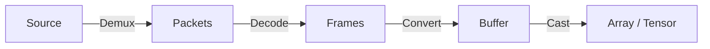

# The `spdl.io` module

## Overview

The `spdl.io` module implements the core functionalities to load media data into arrays.

Loading media data are consisted of 4 phases.



1. Demux the source media into packets
2. Decode the packets and obtain raw frames
3. Convert the frames to contiguous buffer
4. Cast the buffer to array

The individual functionalities are implemented in C++ with multi-threading, so they can
run free from Python's GIL contention.

The [low-level APIs](./core/about.md) implements these individual functionalities.
The [high-level APIs](./api/load.md) combine them to implement common use cases, such as
creating a buffer object from source.

## Async

The `spdl.io` module exposes these funtionalities as asynchronous functions
 using `asyncio`. It is easy to compose multiple coroutines and build a complex task.
You can also mix different kinds of coroutines, including ones from other packages.
Since the async loop will manage the coroutine executions, they are highly resource
efficient.

??? note "Example: Load an image using async API"

    ```python
    >>> import asyncio
    >>> import spdl.io
    >>>
    >>> async def load_image(src):
    ...     # Demux image
    ...     packets = await spdl.io.async_demux_image(src)
    ...
    ...     # Decode packets into frames
    ...     frames = await spdl.io.async_decode_packets(packets)
    ...
    ...     # Convert the frames into buffer
    ...     buffer = await spdl.io.async_convert_frames(frames)
    ...
    ...     # Convert the buffer into NumPy array.
    ...     return spdl.io.to_numpy(buffer)
    >>>
    >>> array = asyncio.run(load_image("sample.jpg"))
    >>>
    ```

For illustration purpose, the following examples show how to implement
batch image loading. For the actual usage, please refer to
[spdl.io.async_load_image_batch][].


??? note "Example: Batch load images"

    ```python
    >>> # Define a coroutine that decodes a single image into frames (but not to buffer)
    >>> async def decode_image(src: str, width: int, height: int, pix_fmt="rgb24"):
    ...     packets = await spdl.io.async_demux_media("image", src)
    ...     # Decode, format and resize
    ...     frames = await spdl.io.async_decode_packets(
    ...         packets,
    ...         filter_desc=spdl.io.get_video_filter_desc(width=width, height=height, pix_fmt=pix_fmt),
    ...     )
    ...     return frames
    >>>
    >>> async def load_image_batch(srcs, width: int = 121, height: int = 121):
    ...     tasks = [asyncio.create_task(decode_image(src, width, height)) for src in srcs]
    ...     frames = await asyncio.gather(*tasks)
    ...     # Convert a list of image frames into a single buffer as a batch
    ...     buffer = await spdl.io.async_convert_frames(frames)
    ...     return spdl.io.to_numpy(buffer)
    >>>
    >>> array = asyncio.run(load_image_batch(["sample1.jpg", "sample2.png"]))
    >>>
    ```
