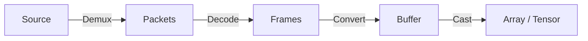

# The `spdl.io` module

## Overview

The `spdl.io` module implements the core functionalities to load media data into arrays.

Loading media data are consisted of 4 phases.



1. Demux the source media into packets
2. Decode the packets and obtain raw frames
3. Convert the frames to contiguous buffer
4. Cast the buffer to array

The individual functionalities are implemented in C++ with multi-threading, so they can
run free from Python's GIL contention.

The [low-level APIs](./core.md) implements these individual functionalities.
The [high-level APIs](./api.md) combine them to implement common use cases, such as
creating a buffer object from source.

## Async and concurrent API

The `spdl.io` module exposes these funtionalities as asynchronous functions of two types.
One as coroutines using `asyncio`, and the other as parallel tasks utilizing
`concurrent.futures.Future`.

The asyncio APIs are only usable with async loop, however it is more flexible than
concurrent API. It is easy to compose multiple coroutines and build a complex task.
You can also mix different kinds of coroutines, including ones from other packages.
Since the async loop will manage the coroutine executions, they are highly resource
efficient.

??? note "Example: Load an image using async API"

    ```python
    >>> import asyncio
    >>> import spdl.io
    >>>
    >>> async def load_image(src):
    ...     # Demux image
    ...     packets = await spdl.io.async_demux_media("image", src)
    ...
    ...     # Decode packets into frames
    ...     frames = await spdl.io.async_decode_packets(packets)
    ...
    ...     # Convert the frames into buffer
    ...     buffer = await spdl.io.async_convert_frames(frames)
    ...
    ...     # Convert the buffer into NumPy array.
    ...     return spdl.io.to_numpy(buffer)
    >>>
    >>> array = asyncio.run(load_image("sample.jpg"))
    >>>
    ```

Future-based asynchronous functions can be used in regular Python code without async loop,
however composition of tasks is tricky and less flexible compared to coroutine-based equivalent.

The concurrent version of demux/decode/convert functions return an object of
`concurrent.futures.Future` type. Usually, the client code must call
`Future.result()` to wait until the result is ready before moving on to the
next step, but this makes it cumbersome to chain the subsequent operations,
and makes it difficult to perfom multiple operations concurrently from Python.

So we implemented two helper functions which facilitate chaining the
concurrent operations.

* [``spdl.utils.chain_futures``][spdl.utils.chain_futures] is a decorator which converts Future Generator to
  a function that returns one Future, which is fullfilled when the Future Generator
  is exhausted. The intermediate Futures are automatically chained and called via
  callback function.
* [``spdl.utils.wait_futures``][spdl.utils.wait_futures] can be used when the client code need to wait for multiple
  ``Future`` objects to fullfill before moving onto the next operation.

The following example is equivalent of the previous async example.

??? note "Example: Load an image using concurrent API"

    ```python
    >>> import spdl.utils
    >>>
    >>> @spdl.utils.chain_futures
    ... def load_image(src):
    ...     # Chain demux, decode and buffer conversion.
    ...     # The result is `concurrent.futures.Future` object
    ...     packets = yield spdl.io.demux_media("image", src)
    ...     frames = yield spdl.io.decode_packets(packets)
    ...     yield spdl.io.convert_frames(frames)
    >>>
    >>>
    >>> # Kick off the task
    >>> future = load_image("sample.jpg")
    >>>
    >>> # Wait until the result is ready
    >>> buffer = future.result()
    >>>
    >>> # Convert the buffer into NumPy array.
    >>> array = spdl.io.to_numpy(buffer)
    >>>
    ```

For illustration purpose, the following examples show how to implement
batch image loading. For the actual usage, please refer to
[spdl.io.async_batch_load_image][] and [spdl.io.batch_load_image][].


??? note "Example: Batch load images with async API"

    ```python
    >>> # Define a coroutine that decodes a single image into frames (but not to buffer)
    >>> async def decode_image(src: str, width: int, height: int, pix_fmt="rgb24"):
    ...     packets = await spdl.io.async_demux_media("image", src)
    ...     # Decode, format and resize
    ...     frames = await spdl.io.async_decode_packets(
    ...         packets,
    ...         filter_desc=spdl.io.get_video_filter_desc(width=width, height=height, pix_fmt=pix_fmt),
    ...     )
    ...     return frames
    >>>
    >>> async def load_image_batch(srcs, width: int = 121, height: int = 121):
    ...     tasks = [asyncio.create_task(decode_image(src, width, height)) for src in srcs]
    ...     frames = await asyncio.gather(*tasks)
    ...     # Convert a list of image frames into a single buffer as a batch
    ...     buffer = await spdl.io.async_convert_frames(frames)
    ...     return spdl.io.to_numpy(buffer)
    >>>
    >>> array = asyncio.run(load_image_batch(["sample1.jpg", "sample2.png"]))
    >>>
    ```

??? note "Example: Batch load images with async API"

    ```python
    >>> @spdl.utils.chain_futures
    ... def _decode(src, width, height):
    ...     packets = yield spdl.io.demux_media("image", src)
    ...     yield spdl.io.decode_packets(packets, width=width, height=height)
    >>>
    >>> @spdl.utils.chain_futures
    ... def _convert(frames_futures):
    ...     frames = yield spdl.utils.wait_futures(frames_futures)
    ...     yield spdl.io.convert_frames(frames)
    >>>
    >>> def batch_decode_image(srcs, width: int = 121, height: int = 121):
    ...     return _convert([_decode(src, width, height) for src in srcs])
    >>>
    >>> # Kick off the task
    >>> futures = batch_decode_image(["sample1.jpg", "sample2.png"])
    >>> # Wait
    >>> buffer = future.result()
    >>> # Convert the buffer into NumPy array.
    >>> array = spdl.io.to_numpy(buffer)
    >>>
    ```
