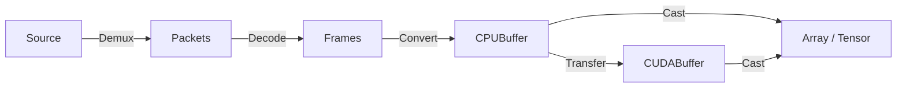

# The `spdl.io` module

## Overview

The `spdl.io` module provides functionalities to load media data into arrays.

Loading media into arrays consists of multiple phases.

1. **Demuxing**: Given the source data (file), slice the binary data into unit objects called packet. `Packets` contain encoded data, such as audio samples and visual frames.
2. **Decoding**: Decode the packets. The resulting objects are refered to as `Frames`. Frames contain raw audio samples and visual frames.
3. **Conversion**: Convert the decoded frames into contiguous memory, so that they can be usedin scientific computing. In SPDL, the result of conversion (contiguous memory) is called `Buffer`.
4. **Transfer**: Optionally, the buffer is moved to GPU devices.
5. **Cast**: Cast the buffer into array/tensor types defined by libraries like NumPy and PyTorch. SPDL implements zero-copy casting.



!!! note

    There are functions skip certain steps. For example NVDEC takes packets and produces CUDA Buffer directly, and NVJPEG consumes source and generates CUDA Buffer directly.

The individual functionalities are implemented in C++, and releases GIL when being executed,
so they can be executed concurrently. 

[The core APIs](./core_load.md) implements individual functionalities.
[The composite APIs](./composite_load.md) combine them to implement common use cases, such as
creating a buffer object from source.

## Async

The `spdl.io` module exposes these funtionalities as asynchronous functions
 using `asyncio`. It is easy to compose multiple coroutines and build a complex task.
You can also mix different kinds of coroutines, including ones from other packages.
Since the async loop will manage the coroutine executions, they are highly resource
efficient.

??? note "Example: Load an image using async API"

    ```python
    >>> import asyncio
    >>> import spdl.io
    >>>
    >>> async def load_image(src):
    ...     # Demux image
    ...     packets = await spdl.io.async_demux_image(src)
    ...
    ...     # Decode packets into frames
    ...     frames = await spdl.io.async_decode_packets(packets)
    ...
    ...     # Convert the frames into buffer
    ...     buffer = await spdl.io.async_convert_frames(frames)
    ...
    ...     # Convert the buffer into NumPy array.
    ...     return spdl.io.to_numpy(buffer)
    >>>
    >>> array = asyncio.run(load_image("sample.jpg"))
    >>>
    ```

For illustration purpose, the following examples show how to implement
batch image loading. For the actual usage, please refer to
[spdl.io.async_load_image_batch][].


??? note "Example: Batch load images"

    ```python
    >>> # Define a coroutine that decodes a single image into frames (but not to buffer)
    >>> async def decode_image(src: str, width: int, height: int, pix_fmt="rgb24"):
    ...     packets = await spdl.io.async_demux_image(src)
    ...     # Decode, format and resize
    ...     frames = await spdl.io.async_decode_packets(
    ...         packets,
    ...         filter_desc=spdl.io.get_video_filter_desc(width=width, height=height, pix_fmt=pix_fmt),
    ...     )
    ...     return frames
    >>>
    >>> async def load_image_batch(srcs, width: int = 121, height: int = 121):
    ...     tasks = [asyncio.create_task(decode_image(src, width, height)) for src in srcs]
    ...     frames = await asyncio.gather(*tasks)
    ...     # Convert a list of image frames into a single buffer as a batch
    ...     buffer = await spdl.io.async_convert_frames(frames)
    ...     return spdl.io.to_numpy(buffer)
    >>>
    >>> array = asyncio.run(load_image_batch(["sample1.jpg", "sample2.png"]))
    >>>
    ```
