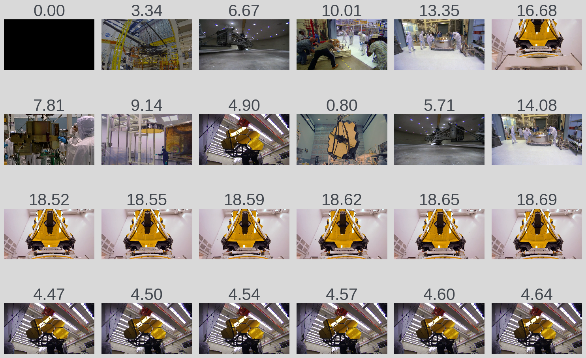

# Preprocessing

## API

When using FFmpeg-based decoders, FFmpeg can also apply preprocessing via
[filters](https://ffmpeg.org/ffmpeg-filters.html).

Client code can pass a custom filter string to `decode` functions.
The following fuctions help build filter parameter for common usecases.

::: spdl.io.get_audio_filter_desc
::: spdl.io.get_video_filter_desc
::: spdl.io.get_filter_desc

## Custom Filtering

Filter description is a simple `str` object. You can write custom filter description
by yourself or insert a part of filter descriptions to the previous helper functions.

!!! note
    Filter is also used for trimming the packets for the user-specified
    timestamp. When demuxing and decoding audio/video for a specific time
    window, packets returned by demuxers contain frames outside of the window,
    because they are necessary to correctly decode frames. This process also
    creates frames outside of the window. Filtering, (`trim` and `atrim`) is
    used to remove these frames.

    So when you create a custom filter for audio/video, make sure that the
    resulting filter removes frames outside of the user specified window.
    This works fine when you use the `get_filter_desc` helper functions.

## Image augmentation

Using filters like `hflip`, `vflip`, `rotate`, `scale` and `crop`, we can compose
an augmentation pipeline.

For the detail of each filter, please refer to
(https://ffmpeg.org/ffmpeg-filters.html)[https://ffmpeg.org/ffmpeg-filters.html].

```python
>>> import random
>>>
>>> def random_augmentation():
...     filters = []
... 
...     # random_hflip
...     if bool(random.getrandbits(1)):
...         filters.append("hflip")
... 
...     # random_vflip
...     if bool(random.getrandbits(1)):
...         filters.append("vflip")
... 
...     # random_rotate +/- 30 deg
...     angle = (60 * random.random() - 30) * 3.14 / 180
...     filters.append(f"rotate=angle={angle:.2f}")
... 
...     # resize
...     filters.append("scale=256:256")
... 
...     # random_crop
...     x_pos, y_pos = random.random(), random.random()
...     filters.append(f"crop=224:224:x={x_pos:.2f}*(iw-ow):y={y_pos:.2f}*(ih-oh)")
... 
...     filter_desc = ",".join(filters)
... 
...     return filter_desc
```

```python
>>> async def load_with_augmentation(src):
...     packets = await spdl.io.async_demux_media("image", src)
...
...     frames = await spdl.io.async_decode_packets(
...         packets,
...         filter_desc=spdl.io.get_video_filter_desc(filter_desc=filter_desc, pix_fmt="rgb24"),
...     )
...
...     buffer = await spdl.io.async_convert_frames(frames)
```

This generates filter descriptions like the following

```
hflip,rotate=angle=-0.05,scale=256:256,crop=224:224:x=0.18*(iw-ow):y=0.17*(ih-oh)
hflip,vflip,rotate=angle=-0.37,scale=256:256,crop=224:224:x=0.09*(iw-ow):y=0.96*(ih-oh)
rotate=angle=0.33,scale=256:256,crop=224:224:x=0.58*(iw-ow):y=0.57*(ih-oh)
hflip,vflip,rotate=angle=0.30,scale=256:256,crop=224:224:x=0.80*(iw-ow):y=0.35*(ih-oh)
hflip,vflip,rotate=angle=0.02,scale=256:256,crop=224:224:x=0.01*(iw-ow):y=0.25*(ih-oh)
vflip,rotate=angle=0.35,scale=256:256,crop=224:224:x=0.42*(iw-ow):y=0.69*(ih-oh)
hflip,rotate=angle=0.22,scale=256:256,crop=224:224:x=0.10*(iw-ow):y=0.03*(ih-oh)
hflip,rotate=angle=-0.18,scale=256:256,crop=224:224:x=0.65*(iw-ow):y=0.31*(ih-oh)
rotate=angle=-0.13,scale=256:256,crop=224:224:x=0.37*(iw-ow):y=0.75*(ih-oh)
hflip,vflip,rotate=angle=0.01,scale=256:256,crop=224:224:x=0.27*(iw-ow):y=0.84*(ih-oh)
hflip,rotate=angle=-0.31,scale=256:256,crop=224:224:x=0.43*(iw-ow):y=0.92*(ih-oh)
hflip,rotate=angle=-0.27,scale=256:256,crop=224:224:x=0.96*(iw-ow):y=0.92*(ih-oh)
vflip,rotate=angle=-0.28,scale=256:256,crop=224:224:x=0.61*(iw-ow):y=0.04*(ih-oh)
hflip,vflip,rotate=angle=0.08,scale=256:256,crop=224:224:x=0.84*(iw-ow):y=0.57*(ih-oh)
hflip,vflip,rotate=angle=0.41,scale=256:256,crop=224:224:x=0.24*(iw-ow):y=0.92*(ih-oh)
hflip,rotate=angle=-0.02,scale=256:256,crop=224:224:x=0.47*(iw-ow):y=0.87*(ih-oh)
hflip,rotate=angle=-0.15,scale=256:256,crop=224:224:x=0.73*(iw-ow):y=0.30*(ih-oh)
vflip,rotate=angle=-0.13,scale=256:256,crop=224:224:x=0.91*(iw-ow):y=0.85*(ih-oh)
vflip,rotate=angle=0.28,scale=256:256,crop=224:224:x=0.62*(iw-ow):y=0.02*(ih-oh)
rotate=angle=0.24,scale=256:256,crop=224:224:x=0.85*(iw-ow):y=0.61*(ih-oh)
vflip,rotate=angle=-0.52,scale=256:256,crop=224:224:x=0.61*(iw-ow):y=0.59*(ih-oh)
vflip,rotate=angle=0.06,scale=256:256,crop=224:224:x=0.08*(iw-ow):y=0.04*(ih-oh)
hflip,rotate=angle=0.50,scale=256:256,crop=224:224:x=0.23*(iw-ow):y=0.42*(ih-oh)
vflip,rotate=angle=0.18,scale=256:256,crop=224:224:x=0.54*(iw-ow):y=0.34*(ih-oh)
```

and here are the resulting images.


## Video frame sampling

When decoding audio or video, SPDL supports specifying the decoding window by timestamps,
but it does not support specifying the window by sample index.

This is because generally speaking, packets objects contain timestamp information, but it
does not have metadata about how many frames there are in packets.

So one cannot reliably know the number of frames, or frame index until decoding is complete.
However, once the decoding is complete, SPDL provides ways to manipulate the frame objects,
so that you can emulate sampling by indexing.

The following code illustrates this;

First we decode frames,

```python

>>> # Demux the first 20 seconds
>>> packets = await spdl.io.async_demux_media("video", path, timestamp=(0, 20))
>>>
>>> # Decode and convert to RGB
>>> frames = await spdl.io.async_decode_packets(
...     packets,
...     filter_desc=spdl.io.get_filter_desc(
...         packets,
...         filter_args={
...             "pix_fmt": "rgb24",
...         },
...     ),
... )
>>> # Say this video is 29.97 FPS
>>> num_frames = len(frames)
600
```

Then we slice the frames object and convert the resulting frames to buffer.

* Slicing at fixed interval

```python
sampled_frames = frames[::100]
```

* Uniform random sampling

```python
num_samples = 6

idx = [random.randint(0, num_frames - 1) for _ in range(num_samples)]
sampled_frames = frames[idx]
```

* Sequential sampling at random index

```python
i = random.randint(0, num_frames - num_samples - 1)
idx = [i + j for j in range(num_samples)]

sampled_frames = frames[idx]
```

Then convert the sampled frames to buffer, then cast to array.

```python
buffer = await spdl.io.async_convert_frames(sampled_frames)
array = spdl.io.to_numpy(buffer)
```

The following figure illustrates the sampled frames.


> From top to bottom: 1. slicing at fixed interval, 2. uniform random samplg and 3&4 two executions of sequential sampling at random index.
