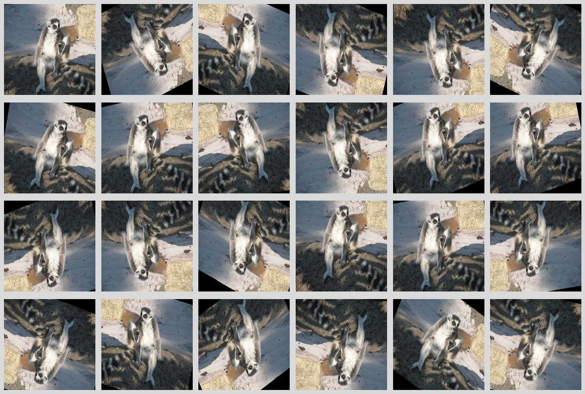

# Preprocessing

## API

When using FFmpeg-based decoders, FFmpeg can also apply preprocessing via
[filters](https://ffmpeg.org/ffmpeg-filters.html).

Client code can pass a custom filter string to `decode` functions.
The following fuctions help build filter parameter for common usecases.

::: spdl.io.get_audio_filter_desc
::: spdl.io.get_video_filter_desc
::: spdl.io.get_filter_desc

## Custom Filtering

Filter description is a simple `str` object. You can write custom filter description
by yourself or insert a part of filter descriptions to the previous helper functions.

!!! note
    Filter is also used for trimming the packets for the user-specified
    timestamp. When demuxing and decoding audio/video for a specific time
    window, packets returned by demuxers contain frames outside of the window,
    because they are necessary to correctly decode frames. This process also
    creates frames outside of the window. Filtering, (`trim` and `atrim`) is
    used to remove these frames.

    So when you create a custom filter for audio/video, make sure that the
    resulting filter removes frames outside of the user specified window.
    This works fine when you use the `get_filter_desc` helper functions.

## Image augmentation

Using filters like `hflip`, `vflip`, `rotate`, `scale` and `crop`, we can compose
an augmentation pipeline.

For the detail of each filter, please refer to
(https://ffmpeg.org/ffmpeg-filters.html)[https://ffmpeg.org/ffmpeg-filters.html].

```python
>>> import random
>>>
>>> def random_augmentation():
...     filters = []
... 
...     # random_hflip
...     if bool(random.getrandbits(1)):
...         filters.append("hflip")
... 
...     # random_vflip
...     if bool(random.getrandbits(1)):
...         filters.append("vflip")
... 
...     # random_rotate +/- 30 deg
...     angle = (60 * random.random() - 30) * 3.14 / 180
...     filters.append(f"rotate=angle={angle:.2f}")
... 
...     # resize
...     filters.append("scale=256:256")
... 
...     # random_crop
...     x_pos, y_pos = random.random(), random.random()
...     filters.append(f"crop=224:224:x={x_pos:.2f}*(iw-ow):y={y_pos:.2f}*(ih-oh)")
... 
...     filter_desc = ",".join(filters)
... 
...     return filter_desc
```

```python
>>> async def load_with_augmentation(src):
...     packets = await spdl.io.async_demux_media("image", src)
...
...     frames = await spdl.io.async_decode_packets(
...         packets,
...         filter_desc=spdl.io.get_video_filter_desc(filter_desc=filter_desc, pix_fmt="rgb24"),
...     )
...
...     buffer = await spdl.io.async_convert_frames(frames)
```

This generates filter descriptions like the following

```
hflip,rotate=angle=-0.05,scale=256:256,crop=224:224:x=0.18*(iw-ow):y=0.17*(ih-oh)
hflip,vflip,rotate=angle=-0.37,scale=256:256,crop=224:224:x=0.09*(iw-ow):y=0.96*(ih-oh)
rotate=angle=0.33,scale=256:256,crop=224:224:x=0.58*(iw-ow):y=0.57*(ih-oh)
hflip,vflip,rotate=angle=0.30,scale=256:256,crop=224:224:x=0.80*(iw-ow):y=0.35*(ih-oh)
hflip,vflip,rotate=angle=0.02,scale=256:256,crop=224:224:x=0.01*(iw-ow):y=0.25*(ih-oh)
vflip,rotate=angle=0.35,scale=256:256,crop=224:224:x=0.42*(iw-ow):y=0.69*(ih-oh)
hflip,rotate=angle=0.22,scale=256:256,crop=224:224:x=0.10*(iw-ow):y=0.03*(ih-oh)
hflip,rotate=angle=-0.18,scale=256:256,crop=224:224:x=0.65*(iw-ow):y=0.31*(ih-oh)
rotate=angle=-0.13,scale=256:256,crop=224:224:x=0.37*(iw-ow):y=0.75*(ih-oh)
hflip,vflip,rotate=angle=0.01,scale=256:256,crop=224:224:x=0.27*(iw-ow):y=0.84*(ih-oh)
hflip,rotate=angle=-0.31,scale=256:256,crop=224:224:x=0.43*(iw-ow):y=0.92*(ih-oh)
hflip,rotate=angle=-0.27,scale=256:256,crop=224:224:x=0.96*(iw-ow):y=0.92*(ih-oh)
vflip,rotate=angle=-0.28,scale=256:256,crop=224:224:x=0.61*(iw-ow):y=0.04*(ih-oh)
hflip,vflip,rotate=angle=0.08,scale=256:256,crop=224:224:x=0.84*(iw-ow):y=0.57*(ih-oh)
hflip,vflip,rotate=angle=0.41,scale=256:256,crop=224:224:x=0.24*(iw-ow):y=0.92*(ih-oh)
hflip,rotate=angle=-0.02,scale=256:256,crop=224:224:x=0.47*(iw-ow):y=0.87*(ih-oh)
hflip,rotate=angle=-0.15,scale=256:256,crop=224:224:x=0.73*(iw-ow):y=0.30*(ih-oh)
vflip,rotate=angle=-0.13,scale=256:256,crop=224:224:x=0.91*(iw-ow):y=0.85*(ih-oh)
vflip,rotate=angle=0.28,scale=256:256,crop=224:224:x=0.62*(iw-ow):y=0.02*(ih-oh)
rotate=angle=0.24,scale=256:256,crop=224:224:x=0.85*(iw-ow):y=0.61*(ih-oh)
vflip,rotate=angle=-0.52,scale=256:256,crop=224:224:x=0.61*(iw-ow):y=0.59*(ih-oh)
vflip,rotate=angle=0.06,scale=256:256,crop=224:224:x=0.08*(iw-ow):y=0.04*(ih-oh)
hflip,rotate=angle=0.50,scale=256:256,crop=224:224:x=0.23*(iw-ow):y=0.42*(ih-oh)
vflip,rotate=angle=0.18,scale=256:256,crop=224:224:x=0.54*(iw-ow):y=0.34*(ih-oh)
```

and here are the resulting images.


